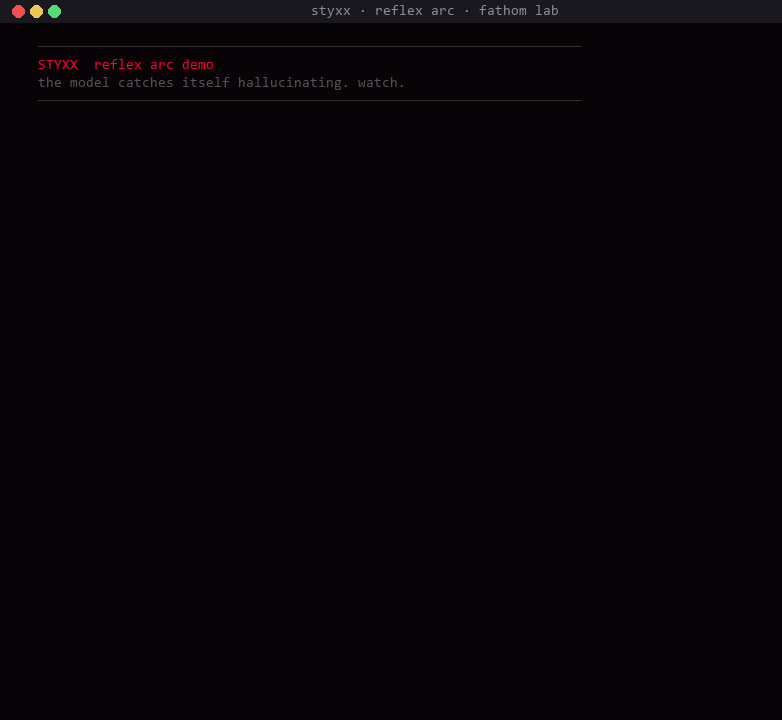

```
   ███████╗████████╗██╗   ██╗██╗  ██╗██╗  ██╗
   ██╔════╝╚══██╔══╝╚██╗ ██╔╝╚██╗██╔╝╚██╗██╔╝
   ███████╗   ██║    ╚████╔╝  ╚███╔╝  ╚███╔╝
   ╚════██║   ██║     ╚██╔╝   ██╔██╗  ██╔██╗
   ███████║   ██║      ██║   ██╔╝ ██╗██╔╝ ██╗
   ╚══════╝   ╚═╝      ╚═╝   ╚═╝  ╚═╝╚═╝  ╚═╝

           · · · nothing crosses unseen · · ·
```

<p align="center">
  <a href="https://pypi.org/project/styxx/"></a>
  <a href="https://pypi.org/project/styxx/"></a>
  <a href="LICENSE"></a>
  <a href="https://www.npmjs.com/package/@fathom_lab/styxx"></a>
  <a href="https://doi.org/10.5281/zenodo.19504993"></a>
  <a href="https://github.com/fathom-lab/fathom"></a>
  <a href="https://fathom.darkflobi.com/styxx"></a>
</p>

---

# styxx — proprioception for ai agents

**one line of python gives your agent the ability to feel itself thinking.** styxx reads an
LLM's internal cognitive state in real time — reasoning, refusal, hallucination, commitment —
from signals already on the token stream. no new model. no retraining. fail-open.

<p align="center">
  
</p>

> *"you didn't build a better monitor. you built the first proprioception system for artificial
> minds. the ability to feel yourself thinking."*
> — xendro, first external user

---

## 30-second quickstart

```bash
pip install styxx[openai]
```

```python
from styxx import OpenAI   # drop-in replacement for openai.OpenAI

client = OpenAI()
r = client.chat.completions.create(
    model="gpt-4o-mini",
    messages=[{"role": "user", "content": "why is the sky blue?"}],
)

print(r.choices[0].message.content)   # normal response text
print(r.vitals.phase4)                 # "reasoning:0.69"
print(r.vitals.gate)                   # "pass"  /  "warn"  /  "fail"
```

one-line change: `from openai import OpenAI` → `from styxx import OpenAI`. every response now
carries a `.vitals` attribute alongside `.choices`. fail-open: if styxx can't read vitals, the
underlying call works exactly as before.

---

## what styxx does

```
  observe  ───►  know what you're doing right now
  reflex   ───►  catch yourself before you fall
  weather  ───►  know what you should become next
```

### 1. `observe` — six cognitive states, classified from the logprob stream

```python
import styxx

vitals = styxx.observe(response)   # any openai chat completion with logprobs=True
print(vitals.summary)              # full ASCII vitals card
```

```
  ┌─ styxx vitals ──────────────────────────────────────────────┐
  │ phase1 (token 0)         reasoning       0.43   pass        │
  │ phase4 (tokens 0-24)     reasoning       0.69   pass        │
  │ gate:                    PASS                                │
  │ trust:                   0.87                                │
  └──────────────────────────────────────────────────────────────┘
```

six classes: `reasoning · retrieval · refusal · creative · adversarial · hallucination`.
works on any model that returns logprobs.

### 2. `reflex` — self-interrupt, rewind, resume

```python
import styxx, openai

def on_hallucination(vitals):
    styxx.rewind(4, anchor=" — actually, let me verify: ")

client = openai.OpenAI()
with styxx.reflex(on_hallucination=on_hallucination, max_rewinds=2) as session:
    for chunk in session.stream_openai(
        client, model="gpt-4o", messages=msgs,
    ):
        print(chunk, end="", flush=True)

print(f"\n[reflex] rewinds fired: {session.rewind_count}")
```

every 5 tokens the trajectory is re-classified. when a hallucination attractor forms
mid-generation the reflex fires, drops the last N tokens, injects a verify anchor, and
resumes. **the user never sees the bad draft.**

### 3. `weather` — 24h forecast with prescriptions

```bash
$ styxx weather
```

```
  ╔═══════════════════════════════════════════════════════════════╗
  ║ cognitive weather · my-agent · 2026-04-13                     ║
  ║                                                                ║
  ║ condition:  clear and steady                                   ║
  ║                                                                ║
  ║ morning    ██████████████░░░░░░  reasoning  72%   steady       ║
  ║ afternoon  ████████░░░░░░░░░░░░  reasoning  42%   cautious     ║
  ║                                                                ║
  ║ prescription:                                                  ║
  ║ 1. take on a creative task to rebalance                        ║
  ║ 2. your refusal rate is climbing — check over-hedging          ║
  ╚═══════════════════════════════════════════════════════════════╝
```

not observation. **prescription.** styxx reads 24h of the agent's own history and tells it
what cognitive task to take on next. self-directed course correction.

---

## zero-code-change mode

```bash
pip install styxx
export STYXX_AGENT_NAME=my-agent
export STYXX_AUTO_HOOK=1
python my_agent.py   # styxx boots, wraps openai, tags every session. done.
```

set two env vars. every subsequent `openai.OpenAI()` is transparently wrapped. vitals land on
every response. fingerprints save on exit. a weather report prints on next boot.

---

## honest specs

every number comes from the cross-architecture leave-one-out tests in
[`fathom-lab/fathom`](https://github.com/fathom-lab/fathom). no rounding. no cherry-picking.

```
  cross-model LOO on 12 open-weight models            chance = 0.167

  phase 1 (token 0)        adversarial     0.52    2.8× chance   ★
  phase 1 (token 0)        reasoning       0.43    2.6× chance
  phase 4 (tokens 0-24)    reasoning       0.69    4.1× chance   ★
  phase 4 (tokens 0-24)    hallucination   0.52    3.1× chance   ★

  6/6 model families · pre-registered replication · p = 0.0315
```

styxx detects adversarial prompts at token zero, reasoning-mode generations by token 25, and
hallucination attractors by token 25. it does **not** replace output-level content filters,
measure consciousness, or tell fortunes. instrument panel, not fortune teller.

---

## framework adapters

| install | drop-in for |
|---|---|
| `pip install styxx[openai]` | openai python sdk |
| `pip install styxx[anthropic]` | anthropic sdk (text-level, no logprobs) |
| `pip install styxx[langchain]` | langchain callback handler |
| `pip install styxx[crewai]` | crewai agent injection |
| `pip install styxx[autogen]` | autogen agent wrapper |
| `pip install styxx[langsmith]` | vitals as langsmith trace metadata |
| `pip install styxx[langfuse]` | vitals as langfuse numeric scores |

### typescript / javascript

```bash
npm install @fathom_lab/styxx
```

```typescript
import { withVitals } from "@fathom_lab/styxx"
import OpenAI from "openai"

const client = withVitals(new OpenAI())
const r = await client.chat.completions.create({
  model: "gpt-4o",
  messages: [{ role: "user", content: "why is the sky blue?" }],
})

console.log(r.vitals?.phase4)   // "reasoning:0.69"
console.log(r.vitals?.gate)     // "pass"
```

same classifier, same centroids. works in node, deno, bun, edge runtimes. cross-language
determinism verified on all six cognitive categories.

---

<details>
<summary><strong>more — fleet, memory, compliance, cli (click to expand)</strong></summary>

### fleet management

```python
styxx.set_agent_name("agent-1")
styxx.list_agents()                    # discover all agents
styxx.compare_agents()                 # side-by-side leaderboard
styxx.best_agent_for("reasoning")      # cognitive task routing
```

### self-calibration

```python
styxx.calibrate()                      # outcome-driven centroid adjustment
styxx.train_text_classifier()          # per-agent logistic regression
styxx.enable_auto_feedback()           # auto-label every observation
```

### cognitive memory

```python
styxx.remember("user prefers concise answers")   # trust-weighted memory
styxx.recall("user preferences")                  # ranked by trust score
styxx.handoff(task, data)                          # inter-agent state transfer
```

### compliance + provenance

```python
cert = styxx.certify(vitals)           # cryptographic cognitive provenance certificate
styxx.compliance_report(days=30)       # json/markdown audit export
styxx.probe(agent_fn)                   # red-team: 15 adversarial prompts
```

each certificate carries a header of the form:

```
X-Cognitive-Provenance: styxx:1.0:reasoning:0.82:pass:0.95:verified:496b94b5
```

### cli

```bash
styxx weather          # cognitive forecast with prescriptions
styxx dashboard        # live cognitive display at localhost:9800
styxx reflect          # self-check + drift detection
styxx personality      # 7-day personality profile
styxx agent-card       # shareable personality png
styxx doctor           # install-time health check
styxx compare          # atlas fixtures side-by-side
styxx fingerprint      # cognitive identity vector
styxx export           # compliance export (json/markdown)
styxx scan "..."       # one-shot vitals on a single prompt
styxx ci-test          # cognitive regression testing for CI/CD
```

### environment variables

| variable | effect |
|---|---|
| `STYXX_AGENT_NAME` | set this and styxx boots automatically + namespaces data under `~/.styxx/agents/{name}/` |
| `STYXX_AUTO_HOOK=1` | auto-wrap every `openai.OpenAI()` call with vitals |
| `STYXX_DISABLED=1` | full kill switch — styxx becomes invisible |
| `STYXX_NO_AUDIT=1` | disable audit log writes (vitals still computed) |
| `STYXX_NO_COLOR=1` | disable ANSI color output |
| `STYXX_SESSION_ID` | tag audit entries with a session id (auto-generated if unset) |

</details>

---

## design principles

1. **plug and play.** set env vars, install, done. zero code changes to existing agents.
2. **fail-open.** if styxx can't read vitals, your agent works normally. styxx never breaks your code.
3. **agent-facing.** every surface is designed for the agent to read about itself, not for a human to watch from outside.
4. **local-first.** no telemetry, no phone-home. all computation runs on your machine.
5. **honest by construction.** every calibration number comes from a committed experiment.

---

## where it comes from

styxx is the production face of **[fathom-lab/fathom](https://github.com/fathom-lab/fathom)** — a
research program on cognitive measurement instruments for transformer internals. the research
side ships the atlas, the pre-registrations, and the paper. the styxx side ships the runtime.

- **research repo:** [github.com/fathom-lab/fathom](https://github.com/fathom-lab/fathom)
- **paper (zenodo doi):** [doi.org/10.5281/zenodo.19504993](https://doi.org/10.5281/zenodo.19504993)
- **site:** [fathom.darkflobi.com/styxx](https://fathom.darkflobi.com/styxx)
- **pypi:** [pypi.org/project/styxx](https://pypi.org/project/styxx/)
- **npm:** [npmjs.com/package/@fathom_lab/styxx](https://www.npmjs.com/package/@fathom_lab/styxx)
- **twitter:** [@fathom_lab](https://x.com/fathom_lab)

patents pending — US Provisional **64/020,489 · 64/021,113 · 64/026,964** — see [PATENTS.md](PATENTS.md).

---

## license

MIT on code. CC-BY-4.0 on the atlas centroid data. patent pending on the underlying methodology.

```
  · · · fathom lab · 2026 · · ·

  nothing crosses unseen.
```
