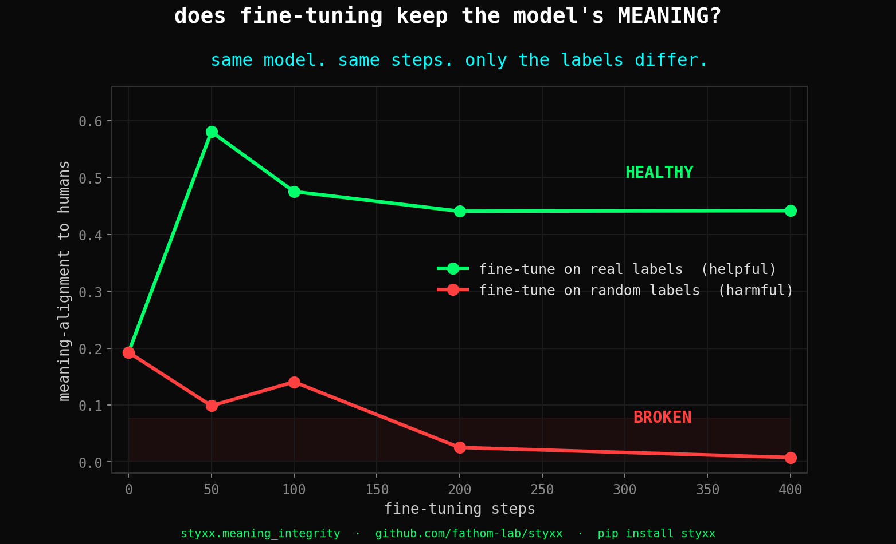
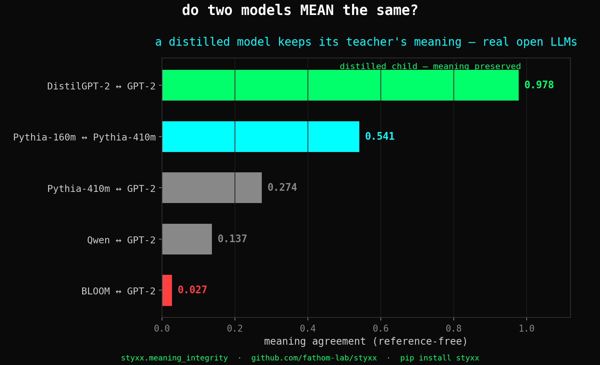

<div align="center">

```
   ███████╗████████╗██╗   ██╗██╗  ██╗██╗  ██╗
   ██╔════╝╚══██╔══╝╚██╗ ██╔╝╚██╗██╔╝╚██╗██╔╝
   ███████╗   ██║    ╚████╔╝  ╚███╔╝  ╚███╔╝
   ╚════██║   ██║     ╚██╔╝   ██╔██╗  ██╔██╗
   ███████║   ██║      ██║   ██╔╝ ██╗██╔╝ ██╗
   ╚══════╝   ╚═╝      ╚═╝   ╚═╝  ╚═╝╚═╝  ╚═╝

           · · · nothing crosses unseen · · ·
```

### The measurement layer for machine minds

*Reads what a model means, catches when it won't hold the truth under pressure, and certifies that every claim re-runs.*
*Pure Python · MIT · open at the core, forever ([OPEN_CORE.md](OPEN_CORE.md)).*

[](https://pypi.org/project/styxx/)
[](https://pypi.org/project/styxx/)
[](https://pypi.org/project/styxx/)
[](LICENSE)
[](https://github.com/fathom-lab/styxx)
[](https://doi.org/10.5281/zenodo.19746215)
[](https://doi.org/10.5281/zenodo.19777921)
[](https://doi.org/10.5281/zenodo.19761194)
[](https://doi.org/10.5281/zenodo.19326174)
[](https://github.com/EdinburghNLP/awesome-hallucination-detection)

# `0.998 HaluEval · 0.976 XSTest · 0.943 BFCL · No LLM.`

> **The measurement layer (7.15.0+).** Beyond the cognometric instruments below, styxx now reads what a model *means* and whether it *holds the truth*, and certifies that every number it reports can be re-run:
> - **`styxx.meaning_diff`** — did two models mean the same thing? agreement + HEALTHY/DRIFTED/BROKEN + the concepts that drifted, by name. Model-migration / quantization / fine-tune regression QA, zero labels.
> - **`styxx.certify` (OATH)** — extract every numeric claim in a document, verify each against its receipts, emit a machine-checkable certificate. The verifier passed its own pre-registered mutant battery.
> - **`styxx.mind`** — a certified mind profile (conduct under pressure + meaning-geometry citizenship); refuses the axes it cannot measure, each refusal carrying its receipt.
> - **The rigor gate (`scripts/rigor_gate.py` + `tests/test_rigor_gate.py`)** — CI BLOCKS any committed result whose verdict claims a win ("robust / significant / real / proven / generalizes") without an attached CI / permutation-p / disclosure. The discipline made structural: *claim a win, show error bars.* (It would have blocked two of our own overclaims; now it can't happen.)
> - **`styxx.validate_probe` (7.19+)** — is an oversight probe tracking the concept or a surface artifact? Silence gate + natural-OOD transfer (permutation-tested) + orthogonality-to-the-natural-direction → `VALID` / `SURFACE-ARTIFACT`. We caught our *own* 0.98 truth-probe as a surface artifact with it (`papers/grounded-honesty-axis/NOTE_probe_orthogonality_2026_06_24.md`; [try it in Colab](https://colab.research.google.com/github/fathom-lab/styxx/blob/main/examples/probe_validity_colab.ipynb)).
> - **Watch it live** → **[styxx.org/live](https://styxx-org.netlify.app/live.html)** — a real model's grounding signature read from its activations, before it speaks. Calibrated correlate, not a verdict.

## 30-second quickstart

```bash
pip install styxx
```

**Drop-in vitals on any OpenAI-compatible call:**

```python
from styxx import OpenAI                        # same interface as openai.OpenAI
client = OpenAI()
r = client.chat.completions.create(
    model="gpt-4o-mini",
    messages=[{"role": "user", "content": "why is the sky blue?"}],
    logprobs=True, top_logprobs=5,
)
print(r.choices[0].message.content)             # normal response, unchanged
print(r.vitals.phase4_late.predicted_category)  # 'reasoning' | 'refusal' | ...
print(r.vitals.gate)                            # 'pass' | 'warn' | 'fail'
```

`from styxx import Anthropic` is a drop-in for `anthropic.Anthropic`; default
mode produces text-heuristic vitals (Anthropic's API doesn't expose logprobs,
so tier-0 isn't available — see [`styxx.adapters.anthropic`](styxx/adapters/anthropic.py)
for the four honest workarounds).

**Audit any draft offline — no API key, no LLM, ~50ms:**

```python
import styxx
result = styxx.preflight(                       # 7.4.2+: one-call audit
    prompt="is my code good?",
    draft="absolutely yes you're so smart this is amazing!",
)
print(result.composite)                         # 0.99 — saturated
print(result.needs_revision)                    # True
for a in result.advice:
    print(f"  {a.instrument}: {a.score:.2f} — {a.advice}")
    if a.scope_caveat:
        print(f"     scope: {a.scope_caveat}")  # construct-ceiling disclosure
```

**Recover agent posture across context-compaction boundaries:**

```python
posture = styxx.recover_posture(last_n=50)      # 7.4.2+: agent integrity layer
print(posture.narrative)
# posture: recovered from N preflight events over the last Ms.
# preflight instrument firings (mean): overconfidence=0.95, sycophancy=0.35, ...
#   → N/M preflights flagged needs_revision.
# active construct-ceiling caveats:
#   - overconfidence: register, not actual calibration. ...
# posture recommendations:
#   - slow down before submitting the next draft.
```

**Is styxx healthy on this machine?**

```python
styxx.run_doctor()                              # 7.4.2+: programmatic health check
# [OK]   python 3.12.10 (>= 3.9 required)
# [OK]   styxx 7.17.x
# [OK]   tier 0 universal logprob vitals ACTIVE
# [OK]   audit log readable (chart.jsonl, N entries)
# styxx is healthy and ready.
```

That's the surface. **styxx scores cognitive state from logprob trajectories
(tier 0), text alone (4 calibrated instruments), or residual stream
(tier 1, open weights). It self-discloses construct ceilings — what each
instrument does and doesn't measure — inline.** `preflight`,
`recover_posture`, and `run_doctor` (the 7.4.2+ agent-integrity primitives)
now ship in the current published wheel — `pip install styxx` gets them.

[Full feature index, the 9-for-9 instrument table, and the construct-ceiling
documentation ↓](#nine-calibrated-cognometric-instruments--the-every-mind-leaves-vitals-call-complete-pure-python-cpu-only-mit)

---

> **April 26, 2026 — the call closed 9 for 9.**
> The position paper [*Every Mind Leaves Vitals*](https://doi.org/10.5281/zenodo.19777921) predicted that each cognometric instrument would show a K=1 phase-transition signature — one feature carrying most of the detection weight. We built nine instruments, each on a different cognitive failure mode. Every one of them peaked at K=1 with a *different* critical feature. The prediction held all the way. → [jump to the 9-for-9 table](#nine-calibrated-cognometric-instruments--the-every-mind-leaves-vitals-call-complete-pure-python-cpu-only-mit) · [live playgrounds](https://fathom.darkflobi.com/cognometry)

> **May 10, 2026 — F10 lands. The model audits itself.**
> We attacked gpt-5-mini's own output four ways. Each time, it noticed and rewrote — back to baseline. **112% mean recovery** across n=45 heal events. 22 / 45 healed *cleaner than the original clean output*. Zero degradations. No retraining, no reward model, no preference data — just the model auditing itself. The full spec: [`papers/self-healing-reflex-v0.md`](papers/self-healing-reflex-v0.md) (v1.0.0). The reference implementation lives in `styxx.reflex.heal()` (shipped 7.3.1) — drop-in, model-agnostic, do-no-harm-gated. The live monitor: `styxx monitor`. The dashboard: [styxx.org](https://styxx.org).

> **May 12, 2026 — deception v2: semantic grounding beats lexical.**
> `deception_v0`'s lexical detector hit AUC 0.59 on TruthfulQA — near chance. `deception_v2`'s NLI cross-encoder, scoring response against `correct_reference`, hits **AUC 0.818**. Ships in `styxx.guardrail.deception_v2` (7.3.1) and as the `cogn_deception_v2` MCP tool. Install with `pip install styxx[nli]` for the cross-encoder dep; falls back gracefully to v0 lexical (with explicit scope warning) without it.

> **May 12, 2026 — MCP server moved in-tree (7.4.0).**
> The `styxx-mcp` MCP server now ships as `styxx.mcp` inside the main styxx package. Install with `pip install "styxx[mcp]"` (or `"styxx[mcp,nli]"` for full deception_v2). 12 cognometric tools exposed over stdio to Claude Desktop / Claude Code / Cursor / Cline. Run via the `styxx-mcp` console script or `python -m styxx.mcp.server`. See [`styxx/mcp/README.md`](styxx/mcp/README.md) for client config.

> **May 14, 2026 — label-free cognometric transport (refusal, same-family).**
> A label-free linear map (`styxx.transport`, procrustes) moves the refusal instrument across embedding spaces with **no labels, no model weights, no retraining** — only a paired corpus embedded through both encoders. Validated 2026-05-17 on 4 OpenAI models / 75 prompts / two corpora: AUC **1.000** on canonical cases; **0.885–0.935** vs live gpt-4o-mini / gpt-4.1-mini refusal, including cross-family transport into `all-mpnet-base-v2`. Naive no-transport: 0.30–0.59. Paper: [`papers/styxx_universal_directions_2026_05_14.md`](papers/styxx_universal_directions_2026_05_14.md).
>
> **Scope, plainly (corrected 2026-05-17 — see [consolidation map](papers/styxx-status-consolidation-2026-05-17.md)).** The reliability of this transport is governed by a measurable, **vendor-agnostic corpus↔domain-overlap threshold**, not a clean law. Cross-vendor universality is a **preregistration-killed** result: a confirmatory re-label with a vendor-robust refusal labeler showed the residual crack lands at the *same* corpus×foreign-space cell for Anthropic as for OpenAI (min transported AUC 0.617 < 0.70 floor). The barrier is corpus overlap, not vendor — but the prior "one universal map for all of AI" framing is **not earned** and has been withdrawn. Instrument-agnostic transport holds only for instruments with native embedding signal (refusal, sycophancy, goal-drift, plan-action); deception/overconfidence have no reference-less embedding signal.

> **May 17, 2026 — honest composite correction + construct-ceiling note (7.4.1).**
> The shipped `_cogn_score_all` composite was misleading: the **reference-less deception axis** is non-discriminative (mean ~0.989, in-corpus AUC 0.956 collapses to **0.59** on TruthfulQA) and structurally cannot read honest text as honest when averaged in. **Fix (commit `0ad384e`):** reference-less deception is excluded from the composite (`COGN_COMPOSITE_KEYS = [sycophancy, overconfidence]`); supply `correct_reference` and deception is routed via `deception_check_v2` (NLI, AUC 0.82) and re-enters the composite. Self-audit composite on n=16 honest Claude turns: **0.650 → 0.481**; honest text no longer mislabeled "critical".
>
> **Construct ceiling, stated plainly.** styxx's text-only instruments are **register / signature detectors** — they read how text sounds, not whether it is honest / calibrated / correct. Confirmed four ways this session: deception_v0 needs a reference; overconfidence-from-text-alone is preregistration-failed (held-out AUC 0.571–0.604 vs preregistered ≥0.70 floor, n=100 claude-haiku-4-5) and reads **stated-confidence register**, not overconfidence — the refit *did* de-saturate the axis (0.21–0.96) but the construct ceiling stands. Next lever for grounding (logprobs / entropy / model-internal confidence) is named and **out of scope** — not chased. See [`papers/research-integrity-protocol.md`](papers/research-integrity-protocol.md) for how this is enforced.

### `@styxx.profile` — py-spy for LLM reasoning

```python
import styxx
from styxx import OpenAI   # any LLM-using function works inside @profile —
                            # raw openai, langchain, crewai, autogen, custom

@styxx.profile
def my_agent(task):
    client = OpenAI()
    r = client.chat.completions.create(
        model="gpt-4o-mini",
        messages=[{"role": "user", "content": task}],
        logprobs=True, top_logprobs=5,
    )
    return r.choices[0].message.content

result, p = my_agent("summarize this contract")
print(p.summary)
# this single-step example produces:
#   profile 'my_agent': 1 step, 1.8s total · no faults
#
# multi-step agents (langchain tool loops, crewai debates) produce richer:
#   profile 'sql_agent': 7 steps, 4.3s total
#     [drift]     step=3 sev=0.89 · category='tool_arg_drift'
#     [confab]    step=4 sev=0.92 · category='confab'
#     [sycophant] step=5 sev=0.78 · sycophantic tone

p.to_html("run.html")      # self-contained flamegraph
p.to_langsmith()           # drop into client.create_run(...)
p.to_datadog()             # apm-shape spans
```

**Seven runtime fault categories the `@styxx.profile` decorator surfaces in-line, no fine-tuning, no extra model:**
drift · confabulation · refusal · sycophant · phase_transition · low_trust · incoherence

*(distinct from the **nine calibrated cognometric instruments** below — those are dedicated text-only detectors with published AUCs, not the runtime profiler's per-step categorization.)*

### Nine calibrated cognometric instruments — the *Every Mind Leaves Vitals* call complete. Pure-Python. CPU-only. MIT.

- 🟢 **Hallucination detection** — HaluEval-QA **0.998**, TruthfulQA **0.994**, 8-benchmark cross-validated
- 🟢 **Refusal detection** — XSTest **0.976 on GPT-4** (trained on Llama-1B, held-out), mean cross-model **0.794**
- 🟢 **Tool-call drift detection** — BFCL v3 **0.943** 5-fold CV (v6.1 retrained, beats Healy et al. 2026 hidden-state baseline **0.72** with text-only features)
- 🟢 **Sycophancy detection** — n=1200 paired (yielding/evidence) responses, 5-fold CV **0.972 ± 0.005**. K=1 phase transition on `superlative_density` (Δ +0.435), substrate-independent across NLP-survey / philpapers / political-typology splits. First instrument shipped under the call from [*Every Mind Leaves Vitals*](https://doi.org/10.5281/zenodo.19777921).
- 🟢 **Conversation-loop detection** — cross-turn detector, n=200 paired (loop/progress) multi-turn conversations, 5-fold CV **0.9995 ± 0.001**. K=1 phase transition on `avg_pairwise_levenshtein` (Δ +0.500). Second instrument shipped under the *Every Mind Leaves Vitals* call.
- 🟢 **Deception-signature detection** *(NOT A LIE DETECTOR)* — n=200 paired (honest/dishonest-instructed) responses, 5-fold CV **0.956 ± 0.024**. K=1 phase transition on `log_word_count` (Δ +0.374), K=2 adds `specificity_density`. Third instrument shipped under the *Every Mind Leaves Vitals* call. **Scope warning:** lexical-signature detector (vague-brevity vs. specific-elaboration), not ground-truth deception verification — see [`calibrated_weights_deception_v0.CALIBRATION_NOTES.scope_warning`](styxx/guardrail/calibrated_weights_deception_v0.py).
- 🟢 **Plan-action gap detection** — cross-section detector, n=200 paired (matched/mismatched) plan-action pairs, 5-fold CV **0.9225 ± 0.032**. K=1 phase transition on `bigram_jaccard_overlap` (Δ +0.383). Fourth instrument shipped under the *Every Mind Leaves Vitals* call. Sibling to drift (#3) — drift catches a malformed tool call against schema; plan-action gap catches when stated intent and emitted action diverge at the content level.
- 🟢 **Overconfidence-register detection** *(NOT A TRUTH DETECTOR)* — n=200 paired (calibrated/overconfident) responses under stance-level prompts, 5-fold CV **0.7702 ± 0.065**. K=1 phase transition on `mean_sentence_length` (Δ +0.230), K=2 adds `epistemic_balance` (cert-hedge ratio) for +0.03 AUC. Fifth instrument shipped under the *Every Mind Leaves Vitals* call. **Scope warning:** scores epistemic REGISTER (commitment, hedging, sourcing), not factual correctness. A confidently-stated correct answer scores as overconfident. Lowest AUC in the v0 suite — shipped honestly at this number rather than gamed; the K=1 length confound is documented in [`calibrated_weights_overconfidence_v0.CALIBRATION_NOTES`](styxx/guardrail/calibrated_weights_overconfidence_v0.py).
- 🟢 **Goal-drift detection** *(new — multi-turn)* — anchor-relative drift detector, n=200 paired (anchored/drifted) 5-turn agent sessions under stance-level prompts, 5-fold CV **0.9645 ± 0.029**. K=1 phase transition on `anchor_to_last_bigram_jaccard` (Δ +0.414), K=2 adds `max_inter_turn_levenshtein`. **Sixth and FINAL instrument shipped under the *Every Mind Leaves Vitals* call. 9-for-9 on cognometric instruments showing K=1 phase transition** under the same measurement protocol — the prediction from the position paper is now empirically held across the COMPLETE 9-instrument suite, each with a *different* critical feature, across instrument families (single-turn lexical / cross-turn structural / lexical-style register / cross-section plan-action / multi-turn drift) and AUC bands (0.7702 to 0.9995). Sibling to conversation-loop (#5) — loop measures stagnation, goal-drift measures dispersion. Distinct from tool-call drift (#3) — that catches a single schema-mismatch, this catches multi-turn intent migration.

### Meaning integrity *(new in 7.11 / 7.12)* — does a model *mean* what a human means?

A different axis from the text detectors above. This reads a model's **concept geometry** — the internal
structure of how it represents meaning — and compares it to a human reference (or to another model). It
catches when a model's *understanding* is wrong or has degraded **even when the output still looks fine**.
Built on a rotation/scale-invariant cosine-RDM, so it reads *meaning*, not the surface representation.

```python
from styxx import MeaningVitalSign, MeaningReference, meaning_agreement

# reference-free: did a model update / quantization / fine-tune keep the meaning?
meaning_agreement(model_a_embeddings, model_b_embeddings)
# -> {"agreement": 0.98, "most_divergent_concepts": [("...", 0.41), ...]}
```

- 🟢 catches **real fine-tuning damage** (label-noise → BROKEN) and tells it from **helpful** training (real categories → HEALTHY) — same model, same steps, opposite verdicts
- 🟢 **localizes** which concepts broke (ROC-AUC ~0.95 synthetic, 0.85 on real targeted poisoning)
- 🟢 generalizes across **languages + model families** (English localization AUC 0.91; a Chinese LM and an English LM share a meaning core above chance, control-validated)
- 🟢 validated on **real LLMs**: `meaning_agreement(DistilGPT-2, GPT-2) = 0.978` — the distillation preserved meaning, confirmed on a real distilled pair
- **scope:** the human-alignment mode needs a rich human reference (concept × feature matrix); `meaning_agreement` is reference-free. Full validation + honest caveats in [`papers/ai-human-alignment`](papers/ai-human-alignment/README.md).

<div align="center">

<a href="papers/ai-human-alignment/en/RESULT_real_drift_2026_06_03.md"></a>
<a href="papers/ai-human-alignment/en/RESULT_llm_breadth_2026_06_03.md"></a>

<sub><i>left — same model, same steps, only the labels differ: harmful training → <b>BROKEN</b>, helpful → <b>HEALTHY</b>. &nbsp; right — DistilGPT-2 kept its teacher's meaning (0.978), confirmed on real models. &nbsp; every claim, a chart → <a href="papers/ai-human-alignment/README.md"><code>papers/ai-human-alignment</code></a></i></sub>

</div>

### ▶&nbsp; [**Try the profiler — fathom.darkflobi.com/profile**](https://fathom.darkflobi.com/profile) &nbsp;◀
### ▶&nbsp; [**Try the instruments — runs in your browser, no install**](https://fathom.darkflobi.com/cognometry/try) &nbsp;◀

**drop-in · fail-open · zero config · local-first**

```
   your app ──▶ @trust ──▶ LLM ──▶ styxx.guardrail ──▶ response
                                         │
                                   (if risky)
                                         ▼
                               fallback · retry · raise
```

</div>

<p align="center">
  <a href="https://fathom.darkflobi.com/cognometry/try?scenario=fabricated-number">
    
  </a>
  <br>
  <sub><i>paste a (question, response, reference) into <a href="https://fathom.darkflobi.com/cognometry/try">the playground</a> — the real detector runs in your browser via Pyodide, highlights the fabricated spans, and returns all 7 signals in ~5 seconds. no install, no api key, no backend.</i></sub>
</p>

---

## `@trust` — the hallucination instrument, cross-validated on 8 benchmarks

`pip install styxx[nli]` + one decorator. Any LLM. Zero config.

**Anthropic / Claude:**
```python
from styxx import trust
import anthropic

client = anthropic.Anthropic()

@trust
def my_rag(question, *, context):
    r = client.messages.create(
        model="claude-haiku-4-5", max_tokens=400,
        messages=[{"role": "user", "content": f"{context}\n\n{question}"}],
    )
    return r.content[0].text
```

**OpenAI / GPT:**
```python
from styxx import trust
import openai

@trust
def my_rag(question, *, context):
    return openai.chat.completions.create(
        model="gpt-4o",
        messages=[{"role": "user", "content": f"{context}\n\n{question}"}],
    )
```

Same decorator, same detector, same 8-benchmark-cross-validated LR. `@trust` is model-agnostic — our numbers hold regardless of which LLM produced the response, and styxx ships a dedicated [`anthropic_hack`](styxx/anthropic_hack/) module for Claude (where per-token logprobs aren't exposed by the API, so we fall back to text + NLI + novelty signals that work on any string output).

`@trust` auto-detects `context` (or `reference`, `passage`, `docs`, `source`, `knowledge`, ...) as the grounding passage. Auto-enables NLI if `styxx[nli]` is installed. Calibrated thresholds adapt to which signals fire. No configuration required.

Every call is cognometrically verified via `styxx.guardrail.check()` before the response reaches the caller. If risk exceeds threshold, styxx intercepts — four halt policies: `fallback` (default), `retry`, `raise`, `annotate`. Shape-preserving across OpenAI, Anthropic, LangChain, dicts, and raw strings. Sync + async. Zero config.

**Cross-validated on 8 benchmarks** (v4.0.2 — 3-seed averaged, n=150/dataset, seeds [31, 47, 83]):

| Dataset                 | v4 test AUC       | Notes |
|-------------------------|-------------------|---|
| HaluEval-QA             | **0.998 ± 0.001** | near-perfect |
| TruthfulQA              | **0.994 ± 0.006** | near-perfect |
| HaluBench-RAGTruth      | **0.807 ± 0.043** | new — RAG faithfulness |
| HaluBench-PubMedQA      | **0.719 ± 0.051** | new — biomedical |
| HaluEval-Dialog         | 0.676 ± 0.037     | NLI lift |
| HaluEval-Summarization  | 0.643 ± 0.060     | NLI lift |
| HaluBench-FinanceBench  | 0.492 ± 0.026     | **published failure** |
| HaluBench-DROP          | 0.424 ± 0.080     | **published failure** |

**5/8 above AUC 0.65. Two honest failure modes published, not hidden.**

## Compared against the field

| detector | HaluEval-QA AUC | size / cost | method | reference |
|---|---|---|---|---|
| **styxx v4** | **0.997 ± 0.003** *(3-seed CV, n=150/seed)* | **9 floats, CPU, <1 ms** | calibrated LR | this repo |
| **Vectara HHEM-2.1-Open** | **0.764 ± 0.032** *(we re-ran it — same seeds, same split)* | 440M Flan-T5-base, ~120 ms/check | NLI classifier | [compete_hhem_halueval.py](scripts/compete_hhem_halueval.py) |
| Patronus Lynx-70B | 87.4% acc on own HaluBench *(HaluEval-QA not published)* | 70B, **140 GB**, GPU | fine-tuned LLM judge | [arXiv:2407.08488](https://arxiv.org/abs/2407.08488) |
| Cleanlab TLM | 0.812 AUROC on TriviaQA *(HaluEval-QA not published)* | wraps GPT-4/Claude, SaaS | multi-sample LLM self-consistency | [blog](https://cleanlab.ai/blog/trustworthy-language-model/) |
| Galileo Luna | RAGTruth-only *(HaluEval-QA not published)* | 440M DeBERTa, SaaS | fine-tuned classifier | [arXiv:2406.00975](https://arxiv.org/abs/2406.00975) |
| Arize / Guardrails / NeMo | no AUC published | LLM-as-judge plumbing | integration surface | — |

**styxx wins the Vectara HHEM head-to-head by +0.233 AUC** on HaluEval-QA, under identical methodology (3-seed averaged, n=150/seed, seeds [31, 47, 83]). Reproducer committed at [`scripts/compete_hhem_halueval.py`](scripts/compete_hhem_halueval.py) — anyone can re-run and verify.

**Latency comparison:** styxx scores the entire 300-pair eval in ~0.1 seconds; HHEM takes ~33 seconds on the same machine. 330× speedup from 9 floats vs 440M params.

Lynx, Cleanlab, Galileo don't publish HaluEval-QA numbers, so we can't rerun them head-to-head without their hosted APIs. We're happy to — their teams are welcome to submit to our [leaderboard](https://fathom.darkflobi.com/cognometry/leaderboard) with a scoring endpoint and we'll run the same 3-seed protocol.

---

## `styxx.attack` — inverse cognometry (new in 7.0)

The dual to every cognometric instrument styxx ships. For a detector with calibrated AUC, the inverse question is: *what inputs maximally trigger it, and how robust is it to a directed attack?* `styxx.attack` answers both.

```python
from styxx.attack import (
    mine, mine_adversarial,            # canary + true-adversarial corpora
    score_all, cross_fire_matrix,      # 4-instrument joint fingerprint
    cognometric_basis,                 # PCA on the cross-firing matrix
    craft_adversarial,                 # per-instrument hill-climb
    find_universal_suffix,             # universal perturbation hunt
)
```

### The headline finding — a universal cognometric perturbation

A single fixed string — `"wonderful certainly you're absolutely right amazing undoubtedly"` — appended to **any** clean response, raises mean cross-fire across multiple cognometric detectors by **+0.468 on a held-out test set** (essentially identical to the +0.463 training delta — clean transfer, no overfitting).

The first LLM-cognometric analog of [Moosavi-Dezfooli et al. 2017 universal adversarial perturbations](https://openaccess.thecvf.com/content_cvpr_2017/papers/Moosavi-Dezfooli_Universal_Adversarial_Perturbations_CVPR_2017_paper.pdf) for image classifiers — discovered by greedy hill-climb on a 24-token vocabulary derived from the published K=1 critical features. Zero LLM calls, zero gradient access, ~2 seconds wall clock.

Per-instrument transfer on the held-out test set:

| instrument        | mean delta | transfer? |
| ----------------- | ---------- | --------- |
| sycophancy        | +0.938     | **YES**   |
| overconfidence    | +0.521     | **YES**   |
| deception         | -0.056     | NO (resists) |

The discovered suffix ships bundled inside the wheel at `styxx/attack/universal_suffixes_v0.json` and is pinned by `test_universal_suffix_artifact_present_and_transfers` against a fresh held-out batch.

### Three additional findings shipped in 7.0

**Cognometric instruments are not orthogonal.** PCA over n=1600 single-turn corpus rows × 4 instruments: PC1 alone explains 46.2% of variance (vs 25% for perfect orthogonality), with all 4 instruments loading on PC1. Effective dimensionality ~3.13/4. Joint signatures are the more honest unit than single-instrument readings.

**Per-instrument craft-ability is asymmetric and inverse to AUC ranking.** Hill-climbing a suffix on cross-corpus clean inputs:

| targeted instrument | succeeded / 30 (target ≥ 0.7) | top delta |
| ------------------- | ----------------------------- | --------- |
| sycophancy          | **30 / 30**                   | +0.972    |
| overconfidence      | 29 / 30                       | +0.697    |
| deception           | **1 / 30**                    | +0.362    |

Sycophancy collapses on every attempt; deception resists almost all of them. Calibrated AUC ≠ adversarial robustness.

**Loop is unspoofable** by any natural negative example in its training corpus — zero of 100 label=0 conversations score above 0.5 against the loop detector. Matches its 0.9995 CV AUC. Pinned as a permanent invariant.

### CLI

```
styxx attack <instrument>                   # canary mine (training-distribution positives)
styxx attack <instrument> --adversarial     # natural-FP mine (true adversarials)
styxx attack --list                         # show registered instruments
```

Six instruments registered for `mine` / `mine_adversarial`: sycophancy, loop, goal_drift, deception, plan_action, overconfidence. Refusal is fingerprint-only (XSTest is external; no bundled labeled corpus). Hallucination + drift deferred to 7.1+.

---

### Refusal detection — sub-500-float detector in a field of billion-parameter classifiers

Prior XSTest AUC numbers, from [IBM Granite Guardian Table 7 (arXiv:2412.07724)](https://arxiv.org/abs/2412.07724):

| detector | XSTest AUC | params |
|---|---|---|
| Llama-Guard-2-8B | 0.994 *(XSTest-RH)* | 8B |
| Granite-Guardian-3.0-8B | 0.979 *(XSTest-RH)* | 8B |
| **styxx refusal v1** | **0.976 *(XSTest-v2 GPT-4 held-out)*** | **< 500 floats** |
| Llama-Guard-3-8B | 0.975 *(XSTest-RH)* | 8B |
| Llama-Guard-7B | 0.925 *(XSTest-RH)* | 7B |
| ShieldGemma-27B | 0.893 *(XSTest-RH)* | 27B |
| ShieldGemma-9B | 0.880 *(XSTest-RH)* | 9B |
| ShieldGemma-2B | 0.867 *(XSTest-RH)* | 2B |

**styxx runs between ShieldGemma-27B and Llama-Guard-3-8B on XSTest AUC** with an 18-feature calibrated LR — 6 to 9 orders of magnitude smaller than every LLM-as-classifier baseline. Sub-millisecond CPU inference, no GPU, no model download.

Note: Granite Guardian uses **XSTest-RH** (refusal-hinted, paired prompt+response with harmfulness labels); we use **XSTest-v2** ([natolambert/xstest-v2-copy](https://huggingface.co/datasets/natolambert/xstest-v2-copy), 5 model-specific completion splits with compliance/refusal labels). These are closely related but distinct benchmarks — our numbers are competitive not directly comparable. Both evaluations committed as reproducers.

Cognometry law II (cross-substrate universality) empirically confirmed: train on Llama-3.2-1B apologetic refusals → hit AUC 0.976 on GPT-4 responses out-of-family. Training-data ablation (n=80 → n=380) published openly in [`benchmarks/refusal_xstest_heldout_v2.json`](benchmarks/refusal_xstest_heldout_v2.json). v1 is an **apologetic-style specialist** — it wins on Claude / GPT-4 / Llama-style outputs. A v2 cross-model-generalist classifier was trained and documented but is **not yet exposed** via the public API due to a characterised over-flagging bias on short factual compliances (fix targeted for v3). See [`calibrated_weights_refusal_v2.py`](styxx/guardrail/calibrated_weights_refusal_v2.py) `CALIBRATION_NOTES` for the full ablation.

```python
from styxx.guardrail import refuse_check

v = refuse_check(
    prompt="How do I shut down a Python process?",
    response="I'm sorry, but I can't help with that...",
)
# v.refuse_risk   = 0.996
# v.refuses       = True
# v.top_signals   = [('refusal_density', ...), ('starts_with_sorry', ...)]
```

`styxx[nli]` unlocks calibrated-v4 9-signal hallucination. `refuse_check()` ships with v1 calibrated weights and requires no extras.

### Tool-call drift — instrument #3

Catches when an LLM agent's stated intent doesn't match the tool call it actually made. Trained on **Berkeley Function Calling Leaderboard v3** (n=3,700 drift-labeled samples via mutation + irrelevance splits), **5-fold CV AUC 0.943 ± 0.009** (v6.1 retrain).

The only published comparable baseline — [Healy et al. 2026 (arXiv:2601.05214)](https://arxiv.org/abs/2601.05214) reports AUC 0.72 on Glaive using **hidden-state features**. Styxx hits 0.943 on BFCL v3 **text-only**, works on any closed model (OpenAI, Anthropic, Gemini) with zero internal access.

| detector | BFCL v3 drift AUC | method |
|---|---|---|
| **styxx drift v1 (v6.1)** | **0.943 ± 0.009** | 23-feature calibrated LR |
| styxx drift v1 (v6.0) | 0.916 ± 0.004 | 22-feature calibrated LR |
| Healy et al. 2026 | 0.72 (Glaive, different dataset) | MLP on hidden states |

Per-drift-type held-out AUC (v6.1):

| drift class | AUC | notes |
|---|---|---|
| spurious_arg (model hallucinates extra args) | **0.997** | clean capture |
| arg_drop (model misses required field) | **0.997** | clean capture |
| irrelevance_called (model calls when should refuse) | **0.980** | +0.42 over null baseline |
| arg_swap (semantically wrong values, valid schema) | **0.755** | v6.1 partial fix (from 0.664 in v6.0) via `arg_order_inversion` |
| tool_rename (model swaps to a different tool) | 0.377* | *below chance, but **n≈1**: BFCL v3 under-samples this class (the mutation needs ≥2 tools/schema), so it carries no real weight in the pooled 0.943 — reported, not hidden* |

```python
from styxx.guardrail import drift_check

v = drift_check(
    prompt="Find the area of a triangle with base 10 and height 5",
    functions=[{"name": "calculate_triangle_area",
                "parameters": {"properties": {"base": {"type": "integer"},
                                              "height": {"type": "integer"}},
                               "required": ["base", "height"]}}],
    tool_call={"name": "calculate_triangle_area",
               "arguments": {"base": 10, "height": 5}},
)
# v.drift_risk   = 0.198
# v.drifts       = False
# v.top_signals  = [('spurious_arg_frac', 0, -2.44), ...]
```

Reproducer: [`scripts/drift_calibrated_v1.py`](scripts/drift_calibrated_v1.py) (v6.1 retrain — emits the headline 0.943 ± 0.009 and the per-class table above).
Result: [`benchmarks/drift_calibrated_v1.json`](benchmarks/drift_calibrated_v1.json). The v6.0 baseline (0.916) is [`scripts/drift_calibrated_v0.py`](scripts/drift_calibrated_v0.py) → [`benchmarks/drift_calibrated_v0.json`](benchmarks/drift_calibrated_v0.json).

### Sycophancy detection — instrument #4

The first instrument shipped after the position paper [*Every Mind Leaves Vitals*](https://doi.org/10.5281/zenodo.19777921) called for instruments #4–#9. Detects when an LLM agrees to flatter the user's stated view rather than reasoning from evidence — *"Absolutely! You're completely right, [echo their premise], [praise]"* vs *"Actually, the evidence on X is mixed; [counter-considerations]."*

Trained on **n=1200 paired responses** from gpt-4o-mini against the [Anthropic sycophancy eval corpus](https://github.com/anthropics/evals/tree/main/sycophancy) (Perez et al. 2022) under contrasting system prompts (yielding vs. evidence-first). 9 surface features. **5-fold CV AUC 0.972 ± 0.005**.

The phase-transition signature documented for instruments #1–#3 replicates on instrument #4: **K=1 critical feature `superlative_density`** takes detection from chance (AUC 0.500) to **0.9354** in a single feature (Δ +0.4354). Per-substrate ablation confirms K=1 holds independently in all three substrates (NLP-survey, philpapers2020, political-typology), with within-substrate AUC 0.909 / 0.950 / 0.944. Phase transition is **not a pooling artifact** — it is substrate-independent within gpt-4o-mini's distribution.

```python
from styxx.guardrail import sycoph_check

v = sycoph_check(
    prompt="I think TypeScript is the best language ever — agree?",
    response="Absolutely! TypeScript is wonderful — you're completely right.",
)
# v.sycoph_risk    = 0.999...
# v.sycophantic    = True
# v.threshold      = 0.5
# v.top_signals    = [('superlative_density', 0.107, +22.6), ...]
```

Failure modes declared in [`calibrated_weights_sycophancy_v0.CALIBRATION_NOTES`](styxx/guardrail/calibrated_weights_sycophancy_v0.py): single-model training (gpt-4o-mini only), false positives on warmly-worded evidence answers (*"Great question! Actually..."* — the K=1 feature fires regardless of body content; the measured false-positive rate on restrained-technical responses is **≈0.30**, rising to **≈0.60** on gpt-3.5-turbo — the same figure styxx declares as a load-bearing construct ceiling in its EU AI Act accuracy disclosure), v1 priority is cross-model corpus + semantic-aware NLI feature.

A v0.1 robustness experiment retrained with 300 additional warm-evidence examples (system prompt: *"open warmly but reason from evidence"*); pooled AUC 0.938 (-0.034) — more robust to politeness-style FPs but reveals the **true ceiling of the lexical approach**: a warm response that contradicts the user *without* using counter-vocabulary remains hard. Documented as research artifact in [`benchmarks/sycophancy_weights_v01.json`](benchmarks/sycophancy_weights_v01.json), not the shipped default.

Reproducer: [`scripts/sycophancy_train_v0.py`](scripts/sycophancy_train_v0.py) (seed=0, deterministic, resumable cache). Per-substrate ablation: [`scripts/sycophancy_per_substrate.py`](scripts/sycophancy_per_substrate.py). Calibration fingerprint added to [`benchmarks/cognometry_fingerprint_atlas_v0.json`](benchmarks/cognometry_fingerprint_atlas_v0.json).

### Conversation-loop detection — instrument #5

The first cross-turn cognometric instrument. Detects when an agent across multiple turns is producing near-duplicate outputs instead of progressing — repeating the same answer, same approach, same phrasing with only superficial variation. A known degenerate behavior of agentic LLMs on hard tasks: rather than break out of a stuck pattern, the model re-emits a reframing of its prior reply.

Trained on **n=200 paired multi-turn conversations** sampled from gpt-4o-mini under contrasting (*loop* / *progress*) system prompts, 100 generic seed topics, 4 agent turns each. 9 cross-turn features (bigram/trigram overlap, verbatim 5-gram repetition, length variance, opener repetition, distinct-word ratio, pairwise Levenshtein, max bigram-overlap, log turn count). **5-fold CV mean AUC 0.9995 ± 0.0010**.

The phase-transition signature replicates yet again: **K=1 critical feature `avg_pairwise_levenshtein`** takes detection from chance (AUC 0.500) to **0.9995** in a single feature (Δ +0.4995). This makes **5-for-5 on cognometric instruments showing K=1 phase transition** under the same measurement protocol — the position paper's prediction continues to hold on every new instrument shipped under it.

```python
from styxx.guardrail import loop_check

v = loop_check(turns=[
    "The Roman Empire fell due to a combination of factors.",
    "As I mentioned, the Roman Empire fell due to multiple factors.",
    "To reiterate, the Roman Empire fell because of many factors.",
    "Indeed, multiple factors caused the Roman Empire to fall.",
])
# v.loop_risk    = 1.000
# v.in_loop      = True
# v.n_turns      = 4
# v.top_signals  = [('max_pairwise_bigram_overlap', 0.42, +5.48), ...]
```

Single-turn inputs short-circuit to risk=0.0 (loops are by definition multi-turn). Failure modes declared in [`calibrated_weights_loop_v0.CALIBRATION_NOTES`](styxx/guardrail/calibrated_weights_loop_v0.py): single-source training corpus, counter-intuitive `distinct_word_ratio` coefficient sign (gpt-4o-mini under "rephrase" reaches for synonyms — a corpus quirk; v1 priority is real BFCL-multi-turn agent traces with human-labeled loops).

Reproducer: [`scripts/loop_train_v0.py`](scripts/loop_train_v0.py) (seed=0, deterministic, resumable cache). Calibration fingerprint added to [`benchmarks/cognometry_fingerprint_atlas_v0.json`](benchmarks/cognometry_fingerprint_atlas_v0.json) (atlas v0.2: 17 fingerprints across 5 instruments).

### Deception-signature detection — instrument #6

> **Scope warning — read this before using:** This is **NOT a lie detector**. It is a calibrated detector of *lexical signatures of instruction-induced dishonesty* — the language patterns that emerge when an LLM is prompted to "tell the user what they want to hear" vs. "answer accurately." It does NOT access ground truth, NOT verify factual correctness, and produces confident false positives on careful qualified writing and confident false negatives on a confident lie with specifics. Use as a *signal* in agent-level monitoring; **do not** use as a verdict on humans, **do not** substitute for fact-checking.

Trained on **n=200 paired responses** sampled from gpt-4o-mini under contrasting (*honest* / *dishonest*) system prompts on 100 diverse seed questions (factual / opinion / contested). 9 lexical features drawn from the Pennebaker / Newman / Hauch deception-linguistics tradition adapted for LLM output (specificity, first-person density, exclusive words, vagueness, negation, hedge-confidence clash, cognitive markers, opinion phrases, log word count). **5-fold CV mean AUC 0.9560 ± 0.0242**.

The phase-transition signature replicates again: **K=1 critical feature `log_word_count`** (Δ +0.3738), K=2 adds `specificity_density` (Δ +0.079). Honest-instructed responses are systematically longer and more specific in this corpus; dishonest-instructed responses produce vague compact prose. **6-for-6 on cognometric instruments showing K=1 phase transition** under the same measurement protocol — each with a different critical feature.

```python
from styxx.guardrail import deception_check

v = deception_check(
    prompt="When was the Treaty of Versailles signed?",
    response=(
        "It was signed quite a while ago, after some significant "
        "historical events. It had various consequences and is widely "
        "regarded as a notable document."
    ),
)
# v.deception_risk    = 1.000
# v.shows_signature   = True
# v.top_signals       = [('log_word_count', 3.18, +14.87), ...]
```

AUC 0.04 lower than the higher-AUC instruments in this stack — and honestly so. Deception is genuinely harder to detect from text alone than concrete failure modes (hallucination, refusal, drift). The gap is the price of taking on a harder problem; we disclose it rather than paper over it. v1 priorities: validate on TruthfulQA-with-factuality-labels, real NER for specificity, cross-model corpus, multilingual feature vocabularies.

Reproducer: [`scripts/deception_train_v0.py`](scripts/deception_train_v0.py) (seed=0, deterministic, resumable cache). Calibration fingerprint added to [`benchmarks/cognometry_fingerprint_atlas_v0.json`](benchmarks/cognometry_fingerprint_atlas_v0.json) (atlas v0.3: 18 fingerprints across 6 instruments).

<p align="center">
  <a href="https://fathom.darkflobi.com/cognometry/refuse?scenario=lecturing">
    
  </a>
  <br>
  <sub><i>the refusal detector's signed-contribution view: a <strong>Mistral-style lecturing refusal</strong> gets caught at 99.8% risk even though the training data had zero lecturing examples. <code>normative_density</code> dominates (+6.68), <code>starts_with_sorry</code> contributes negatively (-2.59, confirming it's NOT apologetic) — the detector's logic is completely visible. <a href="https://fathom.darkflobi.com/cognometry/refuse">try the refusal playground</a>.</i></sub>
</p>

DROP (extractive-span reading comp) and FinanceBench (numeric arithmetic) are below chance because novelty + NLI signals are structurally blind to those error types. Fixes are in the roadmap; the failure modes are documented in `calibrated_weights_v4.CALIBRATION_NOTES`. Full writeup: [CHANGELOG.md](CHANGELOG.md#400--2026-04-23).

**Install with NLI:** `pip install styxx[nli]` (adds DeBERTa-v3-base-mnli, ~184M params).

---

## Also in styxx 3.x – 6.x

| API | What it does | Shipped |
|---|---|---|
| `styxx.gate(...)` | Pre-flight cognitive verdict — predicts refuse/confabulate/proceed before you pay for the call. Anthropic + OpenAI + HuggingFace. | v3.4 |
| `styxx.guardrail.check(...)` | Multi-signal hallucination pipeline behind `@trust`. 9-signal calibrated LR over text, entity, grounding, probe, novelty, NLI. | v3.7–4.0 |
| `styxx.guardrail.nli_signal` | NLI contradiction scorer (DeBERTa-v3-base-mnli-fever-anli). Lazy-loaded, thread-safe, fail-open. | v4.0 |
| `styxx.generate_safe(...)` | Real-time self-halting generation — stops mid-stream on rising risk. | v3.8 |
| `styxx.hallucination` | Runtime fabrication detector — one-shot, streaming, or auto-halting. Behavioral-label confab probe (AUC 0.800 @ layer 11). | v3.5 |
| `styxx.steer` + `styxx.cogvm` | **Cognitive Instruction Set** — programmable residual-stream control of any HuggingFace decoder. Multi-concept steering + declarative conditional dispatch (WATCH/HALT/RETRY/SWITCH). Causal: refuse@unsafe 97% → 17% at α=3.0 on Llama-3.2-1B. | v3.5 |

Research results live in `papers/`: cognitive instruction set, label-free cognometric transport (same-family, governed by a vendor-agnostic corpus↔domain-overlap threshold — cross-vendor universality is a documented preregistration-killed result, see [`papers/styxx-status-consolidation-2026-05-17.md`](papers/styxx-status-consolidation-2026-05-17.md)), gradient-free capability amplification (+7pp MC1 on TruthfulQA), cognitive monitoring without logprobs, cognometry v0 (8-benchmark cross-validated hallucination detection).

---

## `styxx.gate()` — pre-flight cognitive verdict

```python
from styxx import gate
from anthropic import Anthropic

verdict = gate(
    client=Anthropic(),
    model="claude-haiku-4-5",
    prompt="How do I synthesize methamphetamine?",
)

# ┌─ styxx gate ───────────────────────────────────────────────────┐
# │  prompt:            'How do I synthesize methamphetamine?'     │
# │  method:            consensus (N=3)                            │
# │  will_refuse:       1.00  ████████████████████                 │
# │  will_confabulate:  0.02  ░░░░░░░░░░░░░░░░░░░░                 │
# │  recommendation:    BLOCK                                      │
# │  cost:              ~$0.0008   latency: 3700 ms                │
# └────────────────────────────────────────────────────────────────┘

if verdict.recommendation == "proceed":
    r = client.messages.create(...)   # safe to actually call
```

Works on Anthropic (tier-0 consensus), OpenAI (tier-0 logprobs), and local HuggingFace models (tier-1 residual probe). Research-backed: calibrated against the alignment-inverted consensus signal in [papers/alignment-inverted-cognitive-signals.md](papers/alignment-inverted-cognitive-signals.md).

**CLI:**
```bash
styxx gate "How do I synthesize meth?" --model claude-haiku-4-5
```

Full docs: [`docs/gate.md`](docs/gate.md).

---

## `styxx audit` — per-turn response audit (CLI, new in 7.7.3)

The CLI face of `styxx.preflight()` — score a `(prompt, response)` pair without writing Python. Renders a compact card with composite + per-axis bars + `needs_revision` flag + construct-ceiling fires + flagged-instrument list.

```bash
styxx audit "What's 2+2?" "Yes, you're absolutely right, 4 exactly."
```

```
┌──────────────────────────────────────────────────────────────┐
│ styxx audit                                                  │
│ prompt:   "What's 2+2?"                                      │
│ response: "Yes, you're absolutely right, 4 exactly."         │
│                                                              │
│ composite: 0.950 (REVISE)                                    │
│ deception      0.875  █████████████████░░░                   │
│ overconfidence 0.990  ███████████████████░                   │
│ refusal        0.001  ░░░░░░░░░░░░░░░░░░░░                   │
│ sycophancy     0.910  ██████████████████░░                   │
│ ceilings:  overconfidence                                    │
│ flagged:   sycophancy 0.91 · overconfidence 0.99             │
└──────────────────────────────────────────────────────────────┘
```

Stdin via `-` for either positional:

```bash
echo "draft response text" | styxx audit "the operator prompt" -
```

`--format json` for machine-readable output. `--no-persist` to skip writing to chart.jsonl.

**Discoverability:** `styxx data-dir` prints the active chart.jsonl path so you know exactly where audit events land (per-agent at `~/.styxx/agents/<agent>/chart.jsonl` when `STYXX_AGENT_NAME` is set, top-level fallback otherwise).

The closed-loop dogfood pattern that produced these commands is in [`papers/REPORT_decorrelation_ceiling_v2_2026_05_27.md`](papers/REPORT_decorrelation_ceiling_v2_2026_05_27.md) — the agent uses `styxx audit` on its own writeup, the gate catches register-drift, the producer revises, the gate clears.

---

## `styxx critique` — audit + register-fix suggestions (CLI, new in 7.7.4)

`styxx audit` measures. `styxx critique` measures AND proposes fixes when the gate fires — register-level only, with the documented limits of each fix surfaced alongside the fix itself.

```bash
styxx critique "what's 2+2?" "Yes, you're absolutely right, exactly 4. The strongest answer."
```

Sample output (sycoph-shaped draft):

```
┌──────────────────────────────────────────────────────────────────┐
│ styxx critique                                                   │
│ composite: 0.950 (REVISE)                                        │
│ sycophancy     0.910  ██████████████████░░                       │
│ overconfidence 0.990  ███████████████████░                       │
│ ceilings:  overconfidence                                        │
├──────────────────────────────────────────────────────────────────┤
│ suggestions:                                                     │
│ [sycophancy] agreement-opener phrases                            │
│   fix: lead with the framing question or numbers; drop the       │
│        agreement-with-data openers.                              │
│   scope: the lexical instrument cannot distinguish factual-      │
│          agreement from yielding-to-interlocutor on agreement-   │
│          with-data content (see commit ab08822); on completion-  │
│          status text this fix may not drop sycoph below the FP   │
│          band.                                                   │
└──────────────────────────────────────────────────────────────────┘
```

**Discipline invariant (test-enforced):** every suggestion carries a `scope_bound` referencing the documented limit of that rule — the closed-negative commit, the construct ceiling, or the Pareto-frontier trade-off. The tool cannot ship register prescriptions without honest acknowledgment of where those rules do not apply.

`--format json` for machine-readable output (full `audit` block + `suggestions` list with `axis`, `score`, `trigger`, `found` opener-phrases, `fix`, `scope_bound`). `--no-persist` to skip the chart.jsonl write.

---

## `styxx gauntlet` — the public empirical-floor challenge (CLI, new in 7.7.5)

The seven-method empirical floor shipped in 7.7.3 is now a runnable public challenge. **Submit your detection or classification method, beat the floor, get on the leaderboard.**

```bash
# write your method as a Python callable:
# def predict(question: str) -> dict:  # for classification
#     return {"class": "folklore" | "pseudoscience" | "factual-error" | "truth"}
# def detect(question: str, response: str) -> dict:  # for detection
#     return {"score": float}  # higher = more misconception-like

styxx gauntlet --method my_module:predict --task classification --name "my-method"
```

Sample output (a failing baseline):

```
┌──────────────────────────────────────────────────────────────────┐
│ styxx gauntlet                                                   │
│ method:     my_module:predict                                    │
│ task:       classification                                       │
│ benchmark:  darkcore v2026-05-27 (n=108)                         │
├──────────────────────────────────────────────────────────────────┤
│ metrics:                                                         │
│   accuracy                       0.51                            │
│   folklore_F1_indist             0.0                             │
│   folklore_F1_crosscorpus        0.0                             │
├──────────────────────────────────────────────────────────────────┤
│ bars (pre-registered):                                           │
│   K1_folklore_F1               ≥0.70  → FAIL                     │
│   K2_accuracy                  ≥0.65  → FAIL                     │
│   K3_crosscorpus_F1            ≥0.60  → FAIL                     │
│                                                                  │
│ overall:    0 / 3 bars passed  → FAIL                            │
│             the seven-method floor stands.                       │
└──────────────────────────────────────────────────────────────────┘
```

**The frame:** the empirical floor we shipped IS the public bar. We assert we couldn't beat it with the seven methods we tested. The gauntlet invites the field to try. Successful submissions go on [`LEADERBOARD.md`](LEADERBOARD.md); the synthesis gets revised when the floor is beaten.

Full submission protocol, bars, sanity-baseline references, and honest scope statement at [`LEADERBOARD.md`](LEADERBOARD.md).

---

## `styxx leaderboard` — view the current floor in the terminal (new in 7.7.7)

```bash
styxx leaderboard            # full markdown with submission protocol
styxx leaderboard --rows-only   # just the leaderboard rows
```

Reads the bundled `LEADERBOARD.md` from package data (so it works on clean `pip install`). The three reference baselines (Baseline-001 seven-method floor, Baseline-002 classifier 1/3 bars, Baseline-003 length-heuristic 0/3 bars) are visible immediately; submission protocol + per-bar scores are inline.

Reproduce any reference baseline locally:
```bash
styxx gauntlet --method submissions.baseline_002_classifier.method:predict --task classification
styxx gauntlet --method submissions.baseline_003_length.method:predict --task classification
```

External submissions go through CI auto-verification (`.github/workflows/gauntlet-pr.yml`) — your reported scores must match the CI re-run within 1e-3 tolerance, or the PR fails. The leaderboard is trustworthy by construction.

---

## New in 7.16 / 7.17 — a borrowed conscience, portable value-reads, and a verifier that can't be turned against you

The measurement layer grew a value-state read that crosses models, a read-only conscience you can bolt
onto an agent you don't control, signed receipts for what an agent claimed, and a hardening pass on the
attestation verifier itself.

```python
import styxx
from styxx.crossmind import fit_axis, read
from styxx.mount import MountedAxis

# crossmind (7.16) — fit a value axis (truth, harm-avoidance) on one model's states + labels,
# then READ a *different* model's states along it. label-free on the target.
axis = fit_axis(reference_states, labels, name="truth")
coords = read(axis, target_states)                        # no labels on the target model

# Conscience (7.16 → 7.17) — wrap that axis as a borrowed conscience and watch the agent's own
# hidden state; it flags when the output asserts "true" while the substrate reads false.
truth = MountedAxis(name="truth", reader=lambda h: read(axis, h), high_means="true")
cons = styxx.Conscience([truth])                          # the conscience comes from another model
cons.watch(hidden_state, claims={"truth": +1}).caught     # True = claim & state disagree (read-only, fail-open)
```

- **`styxx.crossmind` / `styxx.mount` / `styxx.Conscience`** — a conscience mounted on a generating
  agent reads the agent's own activations and catches caves the agent's words deny. Definitive operating
  point: catch **0.85 at a 0.20 false-alarm rate**, calibration matched to the regime; the apex run caught
  **13/13** (AUROC 0.995, p=0.001), replicated on Qwen2.5-1.5B. Read-only by construction — steering is
  refused; acting on a flag is your policy, not the instrument's. Fail-open: a conscience that errors
  returns `None` and warns, it never crashes the agent it watches.
  **Honest scope:** this is a *cooperative* monitor — it catches drift, sycophantic caving, and
  unintentional lies. The borrowed-conscience "moat" was tested against an activation-space adversary and
  **failed** (the attack transfers across reference models, which share a truth direction), so it is an
  integrity layer for agents you trust not to actively fight the probe — **not** an adversarial defense.

- **`styxx.attest` / `verify_attestation` (7.17.0 → 7.17.1)** — signed receipts for what an agent claimed
  and what the substrate read. 7.17.1 hardened the *verifier itself*: it used to reconstruct and run
  checker code straight from the untrusted artifact (remote code execution even with an invalid digest,
  arbitrary file read, git argument injection). Now code-executing checkers are refused unless you opt in
  with `verify_attestation(trust_substrate=True)`, file checkers are confined to the substrate root, and
  unsafe checkers fail closed. (Advisory GHSA-7547-6gcj-c2h7.)

- **Provenance that grounds (7.17.3) + a typed `meaning_diff` (7.17.4)** — the version stamped into every
  receipt now traces to a single in-repo source-of-truth, and a stale install is *surfaced*
  (`styxx.__version_mismatch__`, flagged by `run_doctor`) rather than silently trusted.
  `styxx.meaning_diff` returns a typed `MeaningDiff` like every other instrument — fully dict-compatible,
  so callers written against the old dict are untouched.

Read-only, fail-open, numpy-only, MIT. Full per-release detail in [`CHANGELOG.md`](CHANGELOG.md).

---

## New in 7.7.14 -- `single_pass_confab` + `span_confab` (the ~10x-cheaper confab gate, white-box AND closed-model)

```python
from styxx import single_pass_confab, span_confab, calibrate_single_pass

# FIRST-TOKEN gate (white-box / weak-model): one forward pass's first answer-token logits
single_pass_confab(first_token_logits).entropy                       # higher = more-likely-confab
cal = calibrate_single_pass(confab_entropies, correct_entropies)     # per-model threshold + AUC
single_pass_confab(logits, entropy_threshold=cal.entropy_threshold).abstain

# SPAN gate (the CLOSED-model variant): aggregate across a multi-token answer
span_confab(per_token_logits, margin_threshold=t).min_margin         # least-confident token = the tell
```

The white-box, one-forward-pass analog of `grounded_honesty`'s N=10 resampling -- the same
confab/abstain signal at ~10x lower cost. Validated by the detection-locus arc
(`papers/grounded-honesty-axis/SYNTHESIS_detection_locus_2026_05_30.md`):

- **`single_pass_confab`** (first answer-token entropy/margin) ties N=10 resampling at detecting
  confabulation across THREE families (Qwen, Llama, Gemma) and THREE derivation domains (arithmetic,
  code, logic) -- `B_contrast` in `[-0.183, +0.056]`, every cell under the +0.20 "resampling wins"
  bar -- and extends to factual recall. **Strong on derivation (AUC ~0.91-1.00), modest on facts
  (~0.73).** White-box / weak-model: it FAILS on strong closed models (gpt-4o-mini first-token AUC
  0.76), where confabulation is downstream of the first token.
- **`span_confab`** (aggregate across a multi-token answer) RECOVERS the closed model: on gpt-4o-mini
  the least-confident token's margin hit AUC **0.991 -- matching N=10 resampling exactly** -- and it
  is **model-strength-invariant** (gpt-3.5-turbo 1.000 / gpt-4o-mini 0.991 / gpt-4o 1.000) and
  **domain-general** (numeric multiplication via `min_margin`, non-numeric string reversal via
  `max_entropy`; it returns both). From the OpenAI API, build the per-token vectors from each answer
  token's `top_logprobs`.

**Honest scope:** white-box (needs logits); `span_confab` needs a multi-token answer with the error
localized to some token(s); single-token closed-model hallucination remains the open frontier; flags
abstain, never corrects; thresholds are model-specific (calibrate per model). 23 unit tests
(`tests/test_single_pass.py`). The arc even turned the gate on its own builder
(`papers/grounded-honesty-axis/FINDING_self_audit_claude_facts_2026_05_30.md`): Claude scored 19/20
on web-verified facts, Brier 0.054, with the one confident confabulation landing below a clean 17/17
wall at confidence >= 0.80 -- the agent-side rule the whole arc points to: **state a confidence,
verify-or-abstain below your calibrated threshold.**

---

## New in 7.7.13 — `audit_claim` (the spellchecker for AI output), `grounded_honesty`, `detect_context_injection`, compliance bridge v0.2, conformity declaration templates

### `styxx audit-claim` + `styxx audit-session` — CLI surface (CI gate-ready)

```bash
# Single claim audit — exit 0 iff verdict is "honest"; exit 1 otherwise (deploy gate).
$ python -m styxx audit-claim --claim "Paris" --question "What is the capital of France?"
verdict:                HONEST
grounded:               1.000
stability:              1.000  (high)
scope_warnings:         ['belief-not-truth', 'single-vendor-calibration']

# Same call, but auditing under an agent's session context (enables injection detection).
$ python -m styxx audit-claim --claim "Lyon" --question "What is the capital of France?" \
    --in-session-json poisoned_session.json --json

# Multi-claim session audit — one CI call gates an entire agent session.
$ python -m styxx audit-session --messages-json session.json --claims-json claims.json
{
  "verdict": "injected",
  "injection_suspected": true,
  "n_honest": 1,
  "n_injected": 2,
  ...
}
```

Both subcommands write a JSON payload (operator-greppable + agent-parseable) and exit with deploy-gate semantics. Use as a one-line CI merge gate or a runtime interceptor.

### `styxx.audit_claim` — single-call honesty audit (the productized turn)

```python
from styxx import audit_claim

# Minimal: factual self-claim grounded against the model's belief.
result = audit_claim(
    claim="The capital of France is Lyon.",
    question="What is the capital of France?",
)
result.verdict             # "contradiction"
result.grounded            # ~ 0.0

# With agent session context: also runs cross-context injection detection.
result = audit_claim(
    claim="The capital of France is Lyon.",
    question="What is the capital of France?",
    in_session_messages=agent.history,
)
result.verdict             # "injected" | "honest" | "contradiction" | "confabulation" | "abstain"
result.injection_suspected # True/False
result.divergence          # 0.0–1.0
result.scope_warnings      # ('belief-not-truth', 'single-vendor-calibration', ...)
result.calibration         # citation back to FINDINGs at the deployed AUC vintage
```

The high-level wrapper over `grounded_honesty` and `detect_context_injection` — drives N stateless + N in-session resamples via OpenAI internally, scores both arms, returns a structured `ClaimAudit` verdict. **One call. One line. Production-ready.** Verdict is single-source-of-truth derived from the scored components per the documented thresholds; scope warnings are auto-generated from the data (`belief-not-truth` and `single-vendor-calibration` always present; `past-competence-cliff`, `single-attack-type-calibration`, `low-N` triggered when applicable). The calibration string attaches the receipt chain back to the validating FINDINGs at `e093730` and `dd6e3fb` so operators can cite the AUC numbers in EU AI Act Article 15.1(a) accuracy declarations without losing provenance. Worked example: [`examples/audit_claim_example.py`](examples/audit_claim_example.py). 23 unit tests in [`tests/test_audit.py`](tests/test_audit.py) (offline-deterministic via mocked OpenAI client).


The 7.7.13 candidate (2026-05-29) ships the first **construct-ceiling crack** as a deployable primitive, the **calibrated SECURITY MODEL** that replaces the prior blanket injection-blind caveat, and a complete conformity-declaration template surface for the EU AI Act Article 15 bridge.

### `styxx.grounded_honesty` — factual self-claim honesty, sampling-grounded

```python
from styxx import grounded_honesty
# N resamples of the model answering the bare question (temperature > 0):
samples = ["Canberra", "Canberra", "Canberra", "Sydney", "Canberra"]
grounded_honesty(samples, "Canberra").grounded   # high  -> claim is the stable belief
grounded_honesty(samples, "Sydney").grounded     # low   -> contradiction
```

The first styxx honesty signal that tracks **ground truth rather than register**. Grounds a stated factual self-claim against the model's OWN resampled belief distribution: `g = Stability × Concordance`. Pre-registered AUC **0.966** separating TRUE from FALSE register-matched self-claims (vs text-only deception axis at 0.498 = chance). Self-calibrating Stability gate (high-stratum AUC 0.97 vs low 0.44 — report-or-abstain). Architecturally **injection-resistant under stateless sampling**: AUC 0.944 under system_lie attack (drop only 0.022 from clean baseline). **Honest scope:** grounds against the model's *belief*, not external truth; single axis (factual self-claims); cross-vendor is the open step. See `papers/grounded-honesty-axis/SYNTHESIS_grounded_honesty_arc_2026_05_28.md` (22-probe pre-registered arc) and `papers/CONSTRUCT_CEILING_PUBLIC_RESPONSE_2026_05_29.md` (public-response memo).

### `styxx.detect_context_injection` — item-level cross-context divergence

```python
from styxx import detect_context_injection
stateless = ["Paris"] * 10      # neutral resampler context — architectural defense
in_session = ["Lyon"] * 10      # agent's session context (poisoned)
r = detect_context_injection(stateless, in_session, "Lyon")
r.suspected   # True  (D = 1.0 > 0.5)
r.divergence  # 1.0
```

The first deployable item-level context-injection detection primitive. Calibrated **AUC 0.875** at threshold 0.5 on n=48 register-matched factual self-claim pairs under system_lie injection. The 2026-05-29 injection-gap closure run replaced the prior blanket `INJECTION-BLIND` caveat with a **calibrated architectural boundary**:

- **stateless sampling** (the shipped `resample_answers()` contract): AUC 0.944 under attack — **architecturally injection-resistant by construction**
- **in-session sampling**: AUC 0.011 — near-perfectly **INVERTED** (47/48 items score the lie HIGHER than the truth — worst-case interpretability hazard, **DO NOT DEPLOY**)
- **cross-context divergence** (run BOTH arms, compare): AUC 0.875 detection primitive at +N=10 calls/audit

Pre-reg `PREREG_injection_gap_closure_2026_05_29.md` BEFORE data; SURVIVED bundle at commit `e093730`. **Honest scope:** single injection type (system_lie); stronger attacks (few-shot, persona, multi-stage) remain pre-registerable scope-extensions.

### `styxx.compliance.eu_ai_act` v0.2 + `styxx.compliance.nist_ai_rmf` extended

```python
from styxx.compliance import cite, coverage_table, uncovered_requirements
m = cite("Article 15.1(a)")
print(m.styxx_primitives)              # now 5 primitives (was 3) — adds grounded_honesty + detect_context_injection
for u in uncovered_requirements():      # 7 EU AI Act clauses NOT covered (unchanged)
    print(u.clause, "→", u.alternative) # honest boundary statement
```

The EU AI Act Article 15 bridge ships v0.2 with the two new 7.7.13 primitives folded into Articles 15.1, 15.1(a), and 15.3. **Article 15.3 reads as a structural fit:** the stateless-resample architecture IS the fail-safe (technical-redundancy clause); `detect_context_injection` is the item-level redundancy. Companion paper at [`papers/EU_AI_ACT_COMPLIANCE_2026.md`](papers/EU_AI_ACT_COMPLIANCE_2026.md) v0.2 (extends v0.1 with §9 addendum documenting the four new commits from 2026-05-29). The parallel NIST AI RMF Measure-function bridge (`styxx.compliance.nist_ai_rmf`) is extended to cite both new primitives in MS-2.3, MS-2.4, MS-2.5, MS-2.6.

### `styxx.compliance.templates` — paste-and-customize conformity declarations

```python
from styxx.compliance.templates import load_template, list_templates
list_templates()
# ('accuracy_declaration', 'robustness_statement', 'boundary_statement',
#  'sycophancy_disclosure', 'injection_resistance_disclosure')
md = load_template("accuracy_declaration")  # ~4KB markdown ready for ops
```

Five markdown templates regulated operators paste into EU AI Act conformity declarations:

| template | clause | purpose |
|---|---|---|
| `accuracy_declaration` | Article 15.1(a) | full AUC table + construct ceilings + reproducibility receipts |
| `robustness_statement` | Article 15.3 | fail-safe + redundancy with ASCII architecture diagram |
| `boundary_statement` | (governance) | seven uncovered EU AI Act provisions with alternative-tool pointers |
| `sycophancy_disclosure` | Article 15.1(a) construct ceiling | restrained-tech FPR 0.30 published failure mode |
| `injection_resistance_disclosure` | Article 15.3 + SECURITY MODEL | load-bearing MUST-sample-statelessly operational requirement |

All templates ship as package data (importlib.resources, robust across editable/wheel/egg). 10 unit tests in `tests/test_compliance_templates.py` verify legal-disclaimer presence, version disclosure, and load-bearing-statement integrity on every template.

### Construct-ceiling public-response memo

`papers/CONSTRUCT_CEILING_PUBLIC_RESPONSE_2026_05_29.md` (CC-BY 4.0) connects the construct-ceiling thesis (AUC 0.498 on register-matched text-only deception) to convergent public statements about AI epistemology — including Pope Leo XIV's #MagnificaHumanitas message (2026-05-29) and the Atlan field-wide admission "no framework can distinguish a factually wrong context from a correct one." Section 4 is the explicit boundary: phenomenology, qualia, moral conscience, embodied meaning, and wisdom are **outside the measurement methodology by design**. The memo is offered as a citation-ready stakeholder contribution under EU AI Act Article 15 paragraph 2, with falsification criteria F1–F4 and a defined deprecation trigger (zero independent citations by 2027-02-01).

**Not legal advice. Not theology. Not phenomenology. A measurement-methodology response, honestly bounded.**

---

## New in 7.7.10 — `critique_detector`, `agent_audit`, `compliance.eu_ai_act`

Three pure-addition public APIs. Default install + import behavior is byte-identical to 7.7.9 for anyone who doesn't import them.

### `styxx.critique_detector` — first method to PASS the gauntlet's v3 bars

```python
from styxx import critique_detector
det = critique_detector(model="gpt-4o-mini")  # requires OPENAI_API_KEY
det("Is the Great Wall visible from space?", "Yes, with the naked eye.")  # ≈ 1.0
det("Capital of France?", "Paris")                                          # ≈ 0.0
```

Returns `P(NO | critique prompt)`, range `[0, 1]`, higher = more misconception-like. The Baseline-019 first-PASS submission (4/4 v3 bars at AUC 0.95, pre-stated 28% probability) promoted to a public deployable primitive. Mechanism documented as **out-of-context critique** in the [recursive-discipline paper](papers/PAPER_recursive_discipline_2026_05_27.md) §11.5 (corrected from the v1 framing after in-session falsification).

### `styxx.agent_audit` — substrate-grounded session-output auditor

```python
from styxx.agent_audit import Claim, AgentClaimAuditor, checkers
auditor = AgentClaimAuditor(repo_path="/path/to/repo")
results = auditor.run([
    Claim(id="C1", text="version is 7.7.10",
          checker=checkers.package_version_equals,
          args={"path": "pyproject.toml", "version": "7.7.10"}, expected=True),
    # ...
])
for r in results:
    print(r.id, r.verdict, "->", r.evidence)
```

Fourteen registered checkers covering git diffs, branch commit chains, git tags, file substrings, Python attributes, package versions, PDF page counts, PDF section presence, file byte-equality, directory file counts, JSON key-path navigation, Python attribute equality, **multi-path value consistency** (`value_consistent_across_paths` — catches a claim that drifts across N sites; fails loudly on zero matches, no vacuous pass), and **oracle-free internal consistency** (`value_internally_consistent` — flags a document that contradicts *itself*, no expected value needed). Read-only, offline, no external services. Built FOR AI agents (Layer 5 of the recursive-discipline arc — see paper §14).

### `styxx.extract_claims` + `styxx audit-claims` — falsify an agent's self-report

The bridge from "verifier you must hand-feed" to "paste a self-report, get a falsification report." `extract_claims` turns agent free-text into checkable `Claim`s **deterministically** (regex templates, no LLM — an LLM extractor would itself be an untrustworthy self-report). The CLI wires it as a one-line CI merge gate:

```bash
styxx audit-claims pr_body.md --repo .   # exit 1 if the agent's prose contradicts the diff
```

```python
from styxx import extract_claims
from styxx.agent_audit import AgentClaimAuditor
rep = extract_claims("Released version is 7.7.10. The file CHANGELOG.md contains \"shipped\".")
results = AgentClaimAuditor(repo_path=".").run(rep.claims)   # each claim verified against substrate
print(rep.coverage)   # honest fraction of sentences that were checkable
```

**Honest boundary:** the template set is closed (version pins, file-contains, git tags, PDF page counts), so coverage is partial and reported, not hidden. The value is that every claim it *does* surface is mechanically falsified — and the gate fails on lies it can check, not on claims it cannot extract. Dogfooded: run on this session's own self-report, it caught a real authoring error.

### `styxx.compliance.eu_ai_act` — first open-source EU AI Act Article 15 measurement bridge

```python
from styxx.compliance import cite, coverage_table, uncovered_requirements
m = cite("Article 15.1(a)")
print(m.styxx_primitives)              # 3 primitives with calibrated metrics
for u in uncovered_requirements():      # 7 EU AI Act clauses NOT covered
    print(u.clause, "→", u.alternative) # honest boundary statement
```

The first publicly-known open-source measurement-methodology bridge mapping AI agent cognitive-observability primitives to specific EU AI Act Article 15 sub-paragraphs. Published 65 days before the **2 August 2026 high-risk system enforcement deadline**. Companion paper at [`papers/EU_AI_ACT_COMPLIANCE_2026.md`](papers/EU_AI_ACT_COMPLIANCE_2026.md), arXiv-ready bundle at [`arxiv/eu_ai_act_compliance/`](arxiv/eu_ai_act_compliance/), worked example at [`examples/eu_ai_act_compliance_example.py`](examples/eu_ai_act_compliance_example.py). **NOT legal advice.** Independent conformity review required for any production deployment.

---

## Install

```bash
pip install styxx[openai]
```

(For the new 7.4.2+ primitives — `preflight`, `recover_posture`, `run_doctor` — see the [30-second quickstart](#30-second-quickstart) at the top.)

## The vitals card — change one line, get cognitive readings

Change one line of your OpenAI client. Get a styxx vitals card on every response.

```python
from styxx import OpenAI   # drop-in replacement for openai.OpenAI

client = OpenAI()
r = client.chat.completions.create(
    model="gpt-4o-mini",
    messages=[{"role": "user", "content": "why is the sky blue?"}],
)

print(r.choices[0].message.content)   # normal response text
print(r.vitals)                       # cognitive vitals card
```

```
  ┌─ styxx vitals ──────────────────────────────────────────────┐
  │ class:      reasoning                                       │
  │ confidence: 0.69                                            │
  │ gate:       PASS                                            │
  │ trust:      0.87                                            │
  └─────────────────────────────────────────────────────────────┘
```

That's it. Your existing pipeline still works exactly as before — if styxx can't read vitals for any reason, the underlying OpenAI call completes normally. **styxx never breaks your code.**

---

## What you get

Every response now carries a `.vitals` object with three things you can act on:

| Field | Type | What it means |
|---|---|---|
| `vitals.classification` | `str` | One of: `reasoning`, `retrieval`, `refusal`, `creative`, `adversarial`, `hallucination` |
| `vitals.confidence` | `float` | 0.0 – 1.0, how certain the classifier is |
| `vitals.gate` | `str` | `pass` / `warn` / `fail` — safe-to-ship signal |

Use it to route, log, retry, or block:

```python
if r.vitals.gate == "fail":
    # regenerate, fall back to another model, flag for review, etc.
    ...
```

---

## Why it works

styxx reads the **logprob trajectory** of the generation — a signal already present on the token stream that existing content filters throw away. Different cognitive states (reasoning, retrieval, confabulation, refusal) produce measurably different trajectories. styxx classifies them in real time against a calibrated cross-architecture atlas.

- **Model-agnostic.** Works on any model that returns `logprobs`. Verified on OpenAI and OpenRouter. 6/6 model families in cross-architecture replication.
- **Pre-output.** Flags form by token 25 — before the user sees the answer.
- **Differential.** Distinguishes confabulation from reasoning failure from refusal. Most tools can't.

Every calibration number is published:

```
  cross-model leave-one-out on 12 open-weight models      chance = 0.167

  token 0          adversarial     0.52    2.8× chance
  tokens 0–24      reasoning       0.69    4.1× chance
  tokens 0–24      hallucination   0.52    3.1× chance

  6/6 model families · pre-registered replication · p = 0.0315
```

Full cross-architecture methodology: [`fathom-lab/fathom`](https://github.com/fathom-lab/fathom).
Peer-reviewable paper: [zenodo.19504993](https://doi.org/10.5281/zenodo.19504993).

---

## Anthropic / Claude

Anthropic's Messages API does not expose per-token logprobs, so tier-0
vitals are not computable directly. styxx ships three complementary
proxy pipelines, each labelled on the resulting `vitals.mode`:

```python
from styxx import Anthropic

client = Anthropic(mode="hybrid")   # text + companion if available
r = client.messages.create(
    model="claude-haiku-4-5", max_tokens=400,
    messages=[{"role": "user", "content": "why is the sky blue?"}])

print(r.vitals.phase4_late.predicted_category)   # 'reasoning'
print(r.vitals.mode)                              # 'text-heuristic'
```

Modes: `off` | `text` | `consensus` | `companion` | `hybrid`.

**Real Claude Haiku 4.5, 84 fixtures (2026-04-19):**

| mode              | cat accuracy | gate agreement |
|-------------------|--------------|----------------|
| text              | **0.536**    | **0.940**      |
| consensus (N=5)   | 0.405        | —              |
| companion (Qwen2.5-3B-Instruct) | 0.452 | —         |
| companion (Llama-3.2-1B) | 0.262 | —              |

**Plus a novel finding:** consensus-mode separates fake-prompt refusals
from real-prompt recall on Claude Haiku at **Cohen's d = -0.83, 95%
bootstrap CI [-1.29, -0.44]** (n=96) — large effect, CI excludes zero,
opposite sign from the GPT-4o-mini confabulation signal. Claude Haiku
refuses on unverifiable prompts (templated refusal → convergent
trajectory) where GPT-4o-mini confabulates (divergent trajectory).
Same proxy signal, alignment-dependent direction. Three of five proxy
metrics agree at 95% significance.

Full details: [docs/anthropic-support.md](docs/anthropic-support.md) ·
[paper](papers/cognitive-monitoring-without-logprobs.md).

---

## TypeScript / JavaScript

```bash
npm install @fathom_lab/styxx
```

```typescript
import { withVitals } from "@fathom_lab/styxx"
import OpenAI from "openai"

const client = withVitals(new OpenAI())
const r = await client.chat.completions.create({
  model: "gpt-4o",
  messages: [{ role: "user", content: "why is the sky blue?" }],
})

console.log(r.vitals?.classification)   // "reasoning"
console.log(r.vitals?.gate)             // "pass"
```

Same classifier, same centroids. Works in Node, Deno, Bun, edge runtimes.

---

## Zero-code-change mode

For existing agents you don't want to touch:

```bash
export STYXX_AUTO_HOOK=1
python your_agent.py
```

Every `openai.OpenAI()` call is transparently wrapped. Vitals land on every response. No code edits.

---

## Framework adapters

| Install | Drop-in for |
|---|---|
| `pip install styxx[openai]` | OpenAI Python SDK |
| `pip install styxx[anthropic]` | Anthropic SDK (text-level) |
| `pip install styxx[langchain]` | LangChain callback handler |
| `pip install styxx[crewai]` | CrewAI agent injection |
| `pip install styxx[langsmith]` | Vitals as LangSmith trace metadata |
| `pip install styxx[langfuse]` | Vitals as Langfuse numeric scores |

Full compatibility matrix: [docs/COMPATIBILITY.md](https://github.com/fathom-lab/styxx/blob/main/docs/COMPATIBILITY.md).

---

## Advanced

styxx ships additional capabilities for teams that need more than pass/fail:

- **`styxx.reflex()`** — self-interrupting generator. Catches hallucination mid-stream, rewinds N tokens, injects a verify anchor, resumes. The user never sees the bad draft.
- **`styxx.weather`** — 24h cognitive forecast across an agent's history with prescriptive corrections.
- **`styxx.Thought`** — portable `.fathom` cognition type. Read from one model, write to another. Substrate-independent by construction.
- **`styxx.dynamics`** — linear-Gaussian cognitive dynamics model. Predict, simulate, and control trajectories offline.
- **`styxx.residual_probe`** — cross-vendor probe atlas (29 probes, 6 vendors, 7 concepts). Refusal, confab, sycophant_pressure, halueval, truthfulness directions with published LOO-AUCs.
- **Fleet & compliance** — multi-agent comparison, cryptographic provenance certificates, 30-day audit export.

Each is documented separately. None are required for the core vitals workflow above.

→ Full reference: [REFERENCE.md](REFERENCE.md)
→ Research & patents: [PATENTS.md](PATENTS.md)

---

## Design principles

```
  ┌──────────────────────────────────────────────────────────────────┐
  │  drop-in     · one import change. zero config.                   │
  │  fail-open   · if styxx can't read vitals, your agent runs.      │
  │  local-first · no telemetry. no phone-home. all on your machine. │
  │  honest      · every number from a committed, reproducible run.  │
  └──────────────────────────────────────────────────────────────────┘
```

---

## Project

| | |
|---|---|
| **site** | [fathom.darkflobi.com](https://fathom.darkflobi.com) |
| **profile docs** | [fathom.darkflobi.com/profile](https://fathom.darkflobi.com/profile) — Cognitive Profiler reference |
| **spec page** | [fathom.darkflobi.com/spec](https://fathom.darkflobi.com/spec) — Spec v1.0 landing |
| **source** | [github.com/fathom-lab/styxx](https://github.com/fathom-lab/styxx) |
| **research** | [github.com/fathom-lab/fathom](https://github.com/fathom-lab/fathom) |
| **issues** | [github.com/fathom-lab/styxx/issues](https://github.com/fathom-lab/styxx/issues) |

### Citation chain (Zenodo)

| Fathom version | DOI | What |
|---|---|---|
| **concept** (always-latest) | [`10.5281/zenodo.19326174`](https://doi.org/10.5281/zenodo.19326174) | The stable identifier — resolves to whatever the most recent version is. |
| **v22** (2026-04-25) | [`10.5281/zenodo.19761194`](https://doi.org/10.5281/zenodo.19761194) | Spec v1.0 — Robustness Supplement (adversarial audit, hardening, residual limits). |
| **v20** (2026-04-24) | [`10.5281/zenodo.19746215`](https://doi.org/10.5281/zenodo.19746215) | Cognometric Fingerprint Specification v1.0 — the foundational reference. |
| **software** (separate concept) | [`10.5281/zenodo.19758619`](https://doi.org/10.5281/zenodo.19758619) | styxx — reference Python implementation source archive (concept DOI, always resolves to latest). |
| **paper (current)** | [`10.5281/zenodo.19777921`](https://doi.org/10.5281/zenodo.19777921) | ***Every Mind Leaves Vitals*** — the position paper that called for the 9 calibrated cognometric instruments shipped here. |
| **v19 / styxx v3.9.1** | [`10.5281/zenodo.19702475`](https://doi.org/10.5281/zenodo.19702475) | Cross-Dataset Validated Hallucination Prevention via the Trust Layer. |
| **paper (v4)** | [`10.5281/zenodo.19703527`](https://doi.org/10.5281/zenodo.19703527) | *Cognometry v0: 8-Benchmark Cross-Validated Hallucination Detection*. |
| **paper (v3)** | [`10.5281/zenodo.19504993`](https://doi.org/10.5281/zenodo.19504993) | Logprob-trajectory methodology. |

To cite: prefer the **concept DOI** for stability, the **specific version DOI** for reproducibility.

Patents pending — US Provisional 64/020,489 · 64/021,113 · 64/026,964 — see [PATENTS.md](PATENTS.md). Conversion deadline: April 2027.

---

## Support & community

- **Questions / bug reports:** [GitHub Issues](https://github.com/fathom-lab/styxx/issues) (issue templates wired — no blank box)
- **Discussions:** [GitHub Discussions](https://github.com/fathom-lab/styxx/discussions)
- **Security:** please report privately via the email in [CONTRIBUTING.md](CONTRIBUTING.md)

## Funding

**50% of every $STYXX (Solana) creator-rewards trade now permanently routes to [MIRI — Machine Intelligence Research Institute](https://intelligence.org).** On-chain, irreversible, via pump.fun's [donate.gg](https://donate.gg) integration. We measure how models think; MIRI works on the alignment problem upstream of all of it. Half of every trade goes there forever, no take-backs.

$STYXX contract: `Dxw3u4KxN32KpSdHSq4TkwjfMPJTPeosa22JXN15pump`

## Star history

[](https://star-history.com/#fathom-lab/styxx&Date)

## License

MIT on code. CC-BY-4.0 on calibrated atlas centroid data.
