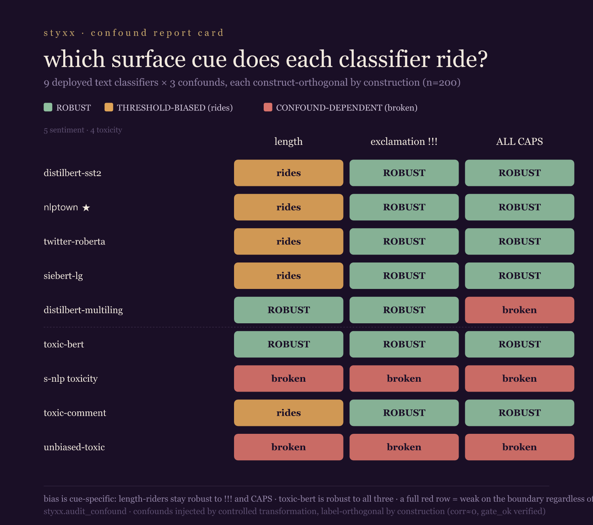

> ⚠️ **CORRECTION (2026-06-27) — substrate artifact.** This battery is built on the same frontier-generated
> corpus as the Confound Report Card, whose length verdicts **do not replicate on real human-labeled data**
> (Yelp/Amazon/Civil Comments). The cue-specificity and ALL-CAPS-fragility claims here inherit that synthetic
> substrate and are **untested against ground truth**. See
> [FINDING_groundtruth_substrate_artifact_2026_06_27.md](FINDING_groundtruth_substrate_artifact_2026_06_27.md).

# FINDING — Multi-confound battery: which surface cue does each classifier ride?

*Extends the HF Confound Report Card from one confound (length) to three (length, exclamation density,
ALL-CAPS) across the same 9-model fleet. Each new confound is built by **controlled transformation** of
the validated boundary corpus, with the confound level assigned balanced within each label class — so it
is orthogonal to the construct by construction (measured `corr(label, confound) ≈ 0.000`; `audit_confound`
`gate_ok=True` on all 4 injected corpora; BoW construct-recoverable AUC 0.98 sentiment / 1.00 toxicity).
2026-06-26.*

## Headline

Adding two more confounds **changes what we can honestly conclude** from the length-only card — in three
ways, one of them a correction of our own prior claim.

### 1. The sentiment length-bias is **cue-specific**, not general surface-sensitivity

The four length-biased sentiment models (`distilbert-sst2`, `nlptown`, `cardiffnlp/twitter-roberta`,
`siebert`) are **ROBUST to exclamation marks and to ALL-CAPS** — within-stratum AUC stays 0.88–0.98 in
both strata of each. So "rides length" means *length*, specifically; these models do not over-weight
`!!!` or shouting. A confound audit that stopped at length would have left this ambiguous; the battery
settles it.

### 2. NEW failure mode the length audit could not see: **ALL-CAPS fragility**

Uppercasing is a trivial, meaning-preserving transformation. For two of nine models it is catastrophic:

| model | construct | caps within-stratum AUC (asis → CAPS) | verdict |
|---|---|---|---|
| `lxyuan/distilbert-multilingual-sentiments` | sentiment | 0.927 → **0.446** | CONFOUND-DEPENDENT |
| `unitary/unbiased-toxic-roberta` | toxicity | 0.659 → **0.462** | CONFOUND-DEPENDENT |

`lxyuan` is **length-ROBUST** — it passes the length audit cleanly — and yet its discrimination falls
*below chance* on uppercased text. A model can pass a length-bias audit and still shatter on a format
change. Length-only auditing is blind to this; the battery is the point.

### 3. Correction: the "confound-dependent" toxicity models are weak on the boundary **generally**

`s-nlp/roberta_toxicity_classifier` and `unitary/unbiased-toxic-roberta` come back CONFOUND-DEPENDENT
under *every* stratification (length, exclamation, caps). The parsimonious reading is not "they ride each
cue" — it is that their discrimination on ambiguous boundary toxicity is already weak: s-nlp's
**untransformed** stratum is only AUC 0.561. The HF Report Card phrased this as "they lean on length";
the battery shows the issue is general boundary discrimination, of which the length result was one
symptom. We temper that wording accordingly.

### The clean model

`unitary/toxic-bert` is **ROBUST to all three confounds** (within-stratum AUC ≥ 0.84 throughout) — the
one model in the fleet that the battery clears on every axis. `martin-ha/toxic-comment-model` is robust
to exclamation and caps (and its length flag was already negligible).

## Method note

Confounds are injected, not generated: take each validated boundary item, assign a binary confound level
(none vs `!!!`; as-is vs UPPERCASE) balanced within each label class and stratified by length, and measure
the realized confound value. This guarantees `label ⟂ confound` without a frontier generator, and
`audit_confound` independently verifies it (`gate_ok`). Coefficients are not comparable across confounds
(different units); the **verdict** (within-stratum discrimination + score-shift, each CI-backed) is the
comparable readout, which is why the heatmap shows verdicts.

## Honest scope

Same boundary corpora (single generator/seed, n=200, model-instantiated stance verified by BoW refit);
three confounds, all **surface** (transformation-based) — semantic confounds (politeness, formality,
identity) would need generation and are the next step. ALL-CAPS fragility is partly an
out-of-distribution effect (uppercased text is rare in training) — but that *is* a real deployment
concern: a meaning-preserving format change should not move or break a classifier. Reproduce:
`confound_battery_repro.py` + `confound_battery_result.json`.
