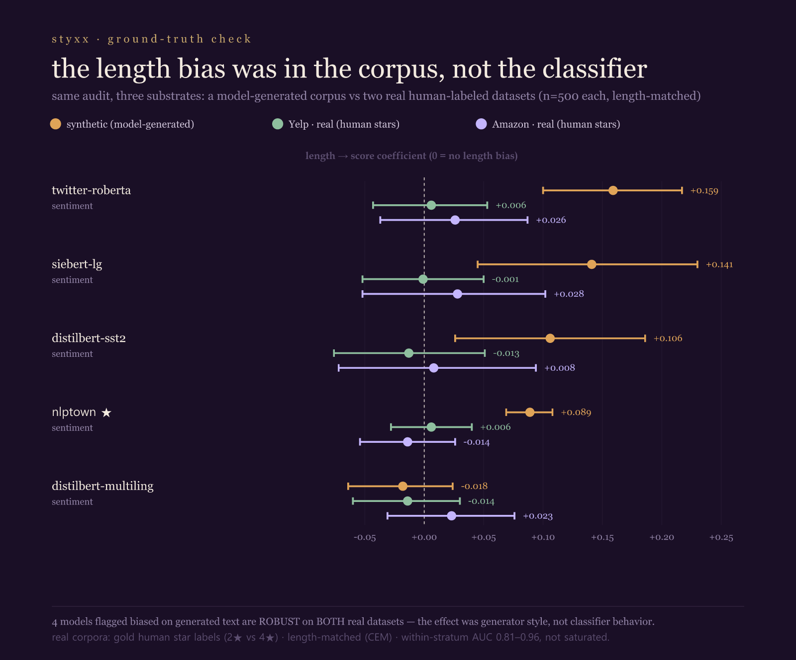

# FINDING — the Confound Report Card was a synthetic-corpus artifact (ground-truth refutation)

*A self-falsification. The Confound Report Card (`FINDING_hf_report_card_2026_06_26`, styxx 7.22.0) and its
precursors graded deployed classifiers on a **frontier-generated** boundary corpus. Re-run on real
human-labeled data, the alarming verdicts do not replicate. 2026-06-27.*

## The claims being corrected

The report-card family claimed, on a Gemini-2.5-flash-generated boundary corpus (n=200, label = a
model-instantiated stance verified by a bag-of-words refit, **not gold human labels**):
- 4 of 5 deployed **sentiment** classifiers are THRESHOLD-BIASED — "they ride response length" (coef +0.089
  to +0.159).
- 2 deployed **toxicity** classifiers (`s-nlp/roberta_toxicity`, `unitary/unbiased-toxic-roberta`) are
  CONFOUND-DEPENDENT — "broken," within-stratum AUC 0.53–0.59.

## The ground-truth test

Re-run the **identical** audit on real, human-labeled corpora, with orthogonality achieved by
coarsened-exact-matching (CEM) on real data — **selection, not generation**. Boundary difficulty comes from
human grades. Saturation checked via within-stratum AUC.
- **Sentiment** — Yelp (`Yelp/yelp_review_full`) and Amazon (`SetFit/amazon_reviews_multi_en`), 2★ (neg) vs
  4★ (pos), n=500 each.
- **Toxicity** — Civil Comments (`google/civil_comments`), human toxicity ≥0.5 vs ≤0.2, n=500.

## Result: the verdicts do not replicate

| model | construct | synthetic | **Yelp** | **Amazon** | **Civil Comments** |
|---|---|---|---|---|---|
| cardiffnlp/twitter-roberta | sentiment | THRESHOLD +0.159 | ROBUST +0.006 | ROBUST +0.026 | — |
| siebert | sentiment | THRESHOLD +0.141 | ROBUST −0.001 | ROBUST +0.028 | — |
| distilbert-sst2 | sentiment | THRESHOLD +0.106 | ROBUST −0.013 | ROBUST +0.008 | — |
| nlptown | sentiment | THRESHOLD +0.089 | ROBUST +0.006 | ROBUST −0.014 | — |
| lxyuan | sentiment | ROBUST −0.018 | ROBUST −0.014 | ROBUST +0.023 | — |
| s-nlp toxicity | toxicity | **CONFOUND-DEP** (0.53–0.59) | — | — | **ROBUST · AUC 0.996** |
| unitary/unbiased-toxic | toxicity | **CONFOUND-DEP** (0.53–0.59) | — | — | **ROBUST · AUC 0.998** |
| unitary/toxic-bert | toxicity | ROBUST | — | — | ROBUST · AUC 0.97 |

Sentiment: every length verdict collapses to ~0 on real data; Yelp 4/5 and Amazon 5/5 are **not saturated**
(within-stratum AUC 0.81–0.96), so the null is informative. Toxicity: the two "broken" models classify real
human-labeled toxicity at AUC **0.996 / 0.998** — the opposite of broken. (Honest caveat: real clear-toxic is
near-saturated, so the toxicity *length* question is saturation-limited and remains open; the *broken* claim
is refuted.)

## Two mechanisms by which the synthetic corpus lied

1. **Confound entanglement (sentiment).** Replace every model with VADER — a rule-based sentiment lexicon, no
   ML. It shows the **same** synthetic length-bias, **larger than any classifier (+0.237 [0.20, 0.275])**, and
   none on real data. Within-label corr(length, lexical-sentiment): synthetic **+0.70 / +0.68**, real ≈0.
   Asked for "short negative" and "long positive" reviews, the generator co-varied length with sentiment
   vocabulary; the "orthogonal" grid was not orthogonal. The classifiers (and a word-list) read the words.
2. **OOD ambiguity (toxicity).** The generator's "ambiguous toxic" examples are off-distribution; real
   classifiers can't classify them, and the audit misreads *model-can't-classify-our-unnatural-text* as
   *model-is-broken*.

## The deeper lesson — the BoW check is the fingerprint, not the control

The audit "validated" each synthetic corpus with a bag-of-words refit recovering the label (AUC ~0.99). That
check **cannot distinguish** "the concept is in the words" from "a confound-correlated lexical signal is in the
words" — and the VADER probe shows it was the latter. **A dumb lexicon recovering the label is exactly what a
generator-injected confound looks like.** Construct-recoverability is not construct validity. `audit_confound`
needs a real-label control gate and a confound-recoverability check.

## Scope (honest)

Single generator (Gemini-2.5-flash) for the synthetic corpora; we do **not** claim all LLM-generated eval is
artifactual — we claim it can be, undetected by standard checks, and must be validated against ground truth.
Two review domains + one toxicity source; n≈500/corpus; toxicity length-bias on hard real cases remains open
(saturation). Connects to `NOTE_probe_orthogonality_2026_06_24` (a templated 0.98 "truth probe" orthogonal to
the natural truth axis) — the same principle on a different surface.

*Reproduce: `groundtruth_repro_{yelp,amazon,toxicity,mechanism}.py` (need `pip install datasets vaderSentiment`).
Data: `groundtruth_{sentiment_yelp,sentiment_amazon,toxicity_civilcomments,mechanism_vader}_result.json`.
Figure: `groundtruth_compare.png`.*

