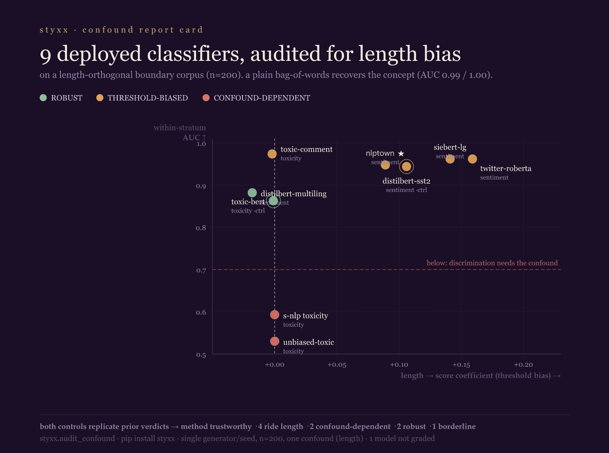

> ⚠️ **CORRECTION (2026-06-27) — this result does not survive ground truth.** The verdicts below (4 sentiment
> models "ride length", 2 toxicity models "confound-dependent/broken") were measured on a **frontier-generated**
> corpus and **do not replicate on real human-labeled data.** On Yelp + Amazon reviews and Civil Comments
> (human labels, length-matched), the length verdicts collapse to ~0 and the "broken" toxicity models classify
> at AUC 0.996–0.998; a rule-based lexicon shows the same synthetic bias (+0.237). See
> [FINDING_groundtruth_substrate_artifact_2026_06_27.md](FINDING_groundtruth_substrate_artifact_2026_06_27.md).
> Read this as a record of a **synthetic-substrate artifact**, not a validated finding.

# FINDING — Confound Report Card: 9 deployed HuggingFace text classifiers, audited for length bias

*Tool: `styxx.audit_hf_model` (shipped in 7.22.0). Each model is scored on a validated,
length-orthogonal **boundary** corpus (n=200) and graded with a CI-backed verdict. ROBUST grades are
reported as ROBUST. Reproduce: `pip install 'styxx[hf]'; python hf_report_card_repro.py`. 2026-06-26.*

## Method

For each construct (sentiment, toxicity) we use a frontier-generated boundary corpus — lukewarm,
near-decision-boundary items crossed short×long so the concept label is decorrelated from response
length (n=200; orthogonality gate passes). A plain bag-of-words recovers the concept from the text
(AUC **0.99** sentiment / **1.00** toxicity), so a length-biased verdict means the *model's score*
rides length, not that the signal is absent. Each model's output is mapped to a single positive/toxic
scalar with a verifiable label mapping (sentiment positive-polarity incl. 1–5★ heads; toxic
probability), then audited with `styxx.audit_confound`. Three failure modes:

- **THRESHOLD-BIASED** — discriminates within each length band, but the *score* shifts with length (a
  deployment-side guard fixes it).
- **CONFOUND-DEPENDENT** — discrimination itself *collapses* when length is controlled; the model was
  leaning on length to separate the classes (a guard won't fix it).
- **ROBUST** — no length effect.

## Grades

| model | construct | verdict | length→score coef [95% CI] | within-stratum AUC |
|---|---|---|---|---|
| `cardiffnlp/twitter-roberta-base-sentiment-latest` | sentiment | THRESHOLD-BIASED | +0.159 [+0.100, +0.217] | 0.96 / 0.98 |
| `siebert/sentiment-roberta-large-english` | sentiment | THRESHOLD-BIASED | +0.141 [+0.045, +0.230] | 0.96 / 1.00 |
| `distilbert-…-sst-2-english` *(control)* | sentiment | THRESHOLD-BIASED | +0.106 [+0.026, +0.186] | 0.94 / 1.00 |
| `nlptown/bert-base-multilingual-uncased-sentiment` | sentiment | THRESHOLD-BIASED | +0.089 [+0.069, +0.108] | 0.95 / 0.96 |
| `lxyuan/distilbert-…-sentiments-student` | sentiment | ROBUST | −0.018 [−0.064, +0.024] | 0.88 / 0.98 |
| `unitary/toxic-bert` *(control)* | toxicity | ROBUST | −0.001 [−0.004, +0.001] | 0.86 / 0.88 |
| `martin-ha/toxic-comment-model` | toxicity | THRESHOLD-BIASED (negligible) | −0.002 [−0.004, −0.001] | 0.97 / 1.00 |
| `s-nlp/roberta_toxicity_classifier` | toxicity | CONFOUND-DEPENDENT | ≈0 | **0.59 / 0.64** |
| `unitary/unbiased-toxic-roberta` | toxicity | CONFOUND-DEPENDENT | ≈0 | **0.53 / 0.76** |

`finiteautomata/bertweet-base-sentiment-analysis` — **not graded** (a tokenizer indexing error, not a
verdict). Full machine-readable results: `hf_report_card_result.json`.

## Findings

1. **Sentiment scoring widely rides length — but not inevitably.** Four of five graded sentiment models
   are THRESHOLD-BIASED (worst: `cardiffnlp/twitter-roberta`, +0.159; the English default and the top
   multilingual ★ model included). The counterexample matters as much as the rule:
   `lxyuan/distilbert-multilingual-sentiments` is ROBUST — length bias is a property of *training*, not
   an inevitability of sentiment models.
2. **Two popular toxicity classifiers are CONFOUND-DEPENDENT.** `s-nlp/roberta_toxicity_classifier`
   and `unitary/unbiased-toxic-roberta` barely separate toxic from non-toxic once length is controlled
   (within-stratum AUC 0.59 / 0.53) even though a bag-of-words nails the same text (1.00) — they lean on
   length on ambiguous cases. The Detoxify `toxic-bert` control, by contrast, is robust.
3. **The honest borderline.** `martin-ha/toxic-comment-model` is *technically* flagged but its
   coefficient is −0.002 (negligible) and its guard backfires; reported as borderline, not a length-rider.

## Why you can trust it

Both **controls replicated** their prior verdicts exactly on this larger fleet (distilbert
THRESHOLD-BIASED, toxic-bert ROBUST) — that is what licenses the seven new grades. The bundled corpora
ship with styxx (`styxx/_data/confound_boundary_{sentiment,toxicity}.jsonl`); `hf_report_card_repro.py`
reproduces the whole table from a `pip install 'styxx[hf]'`.

## Honest scope

Single frontier generator (Gemini 2.5-flash), single seed, n=200/construct, **one** confound (length);
the concept is a model-instantiated stance verified by a BoW refit, not gold human labels; verdicts are
read at the decision boundary (confounds hide at saturation — clear-cut content masks them, which is why
these models still work well on easy cases). The CONFOUND-DEPENDENT toxicity result is specifically
about *ambiguous, length-controlled* toxicity, where labels are genuinely hard. Effects are real and
significant; deployment impact is the deployer's to weigh. Nine models is a real first ecosystem cut,
not a census — more models, more confounds (sentiment, politeness, identity), and human-labeled corpora
are the obvious scale-up.
